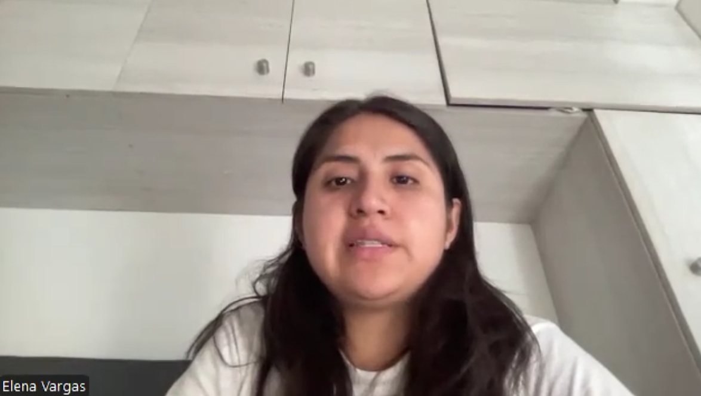
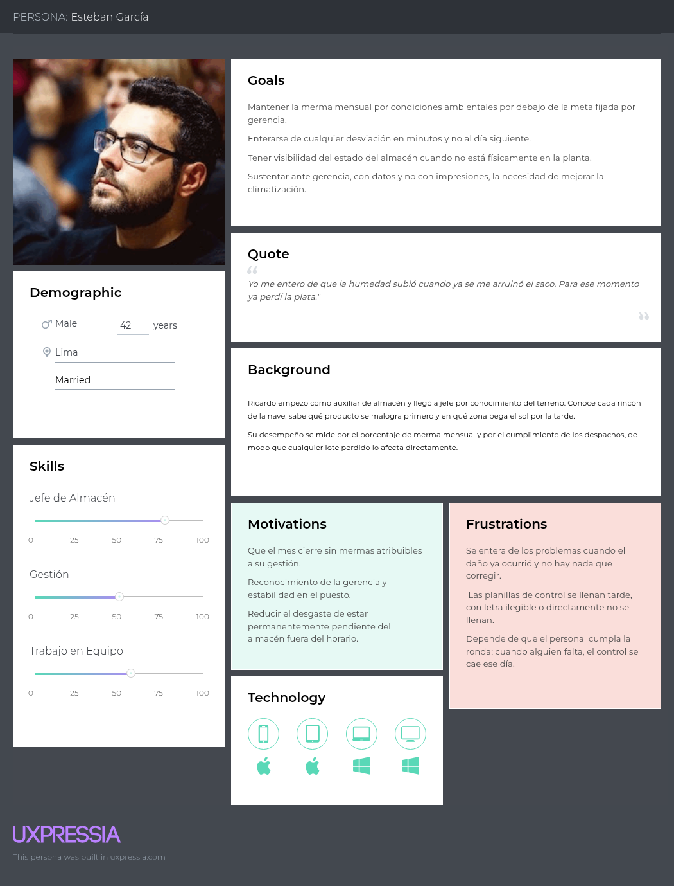
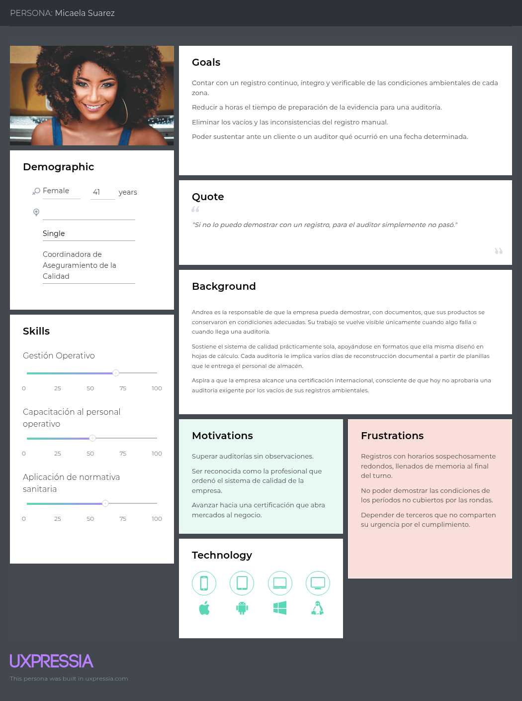
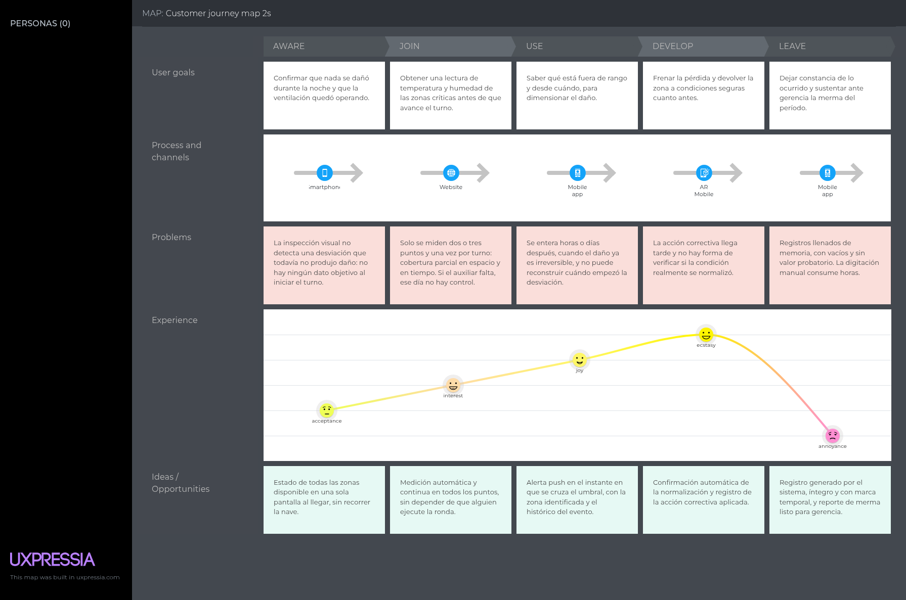
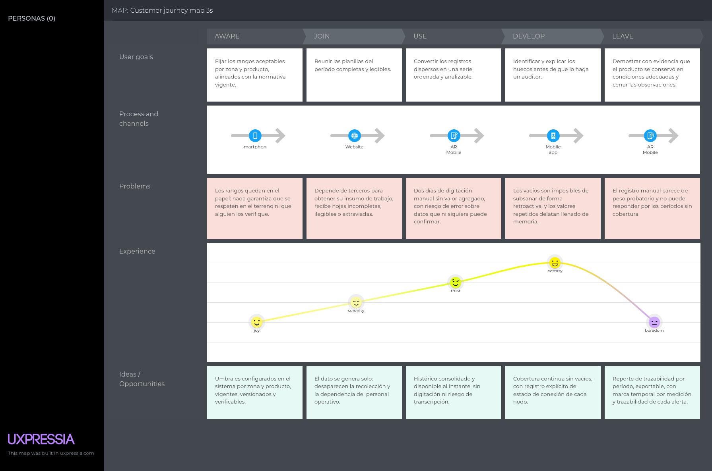
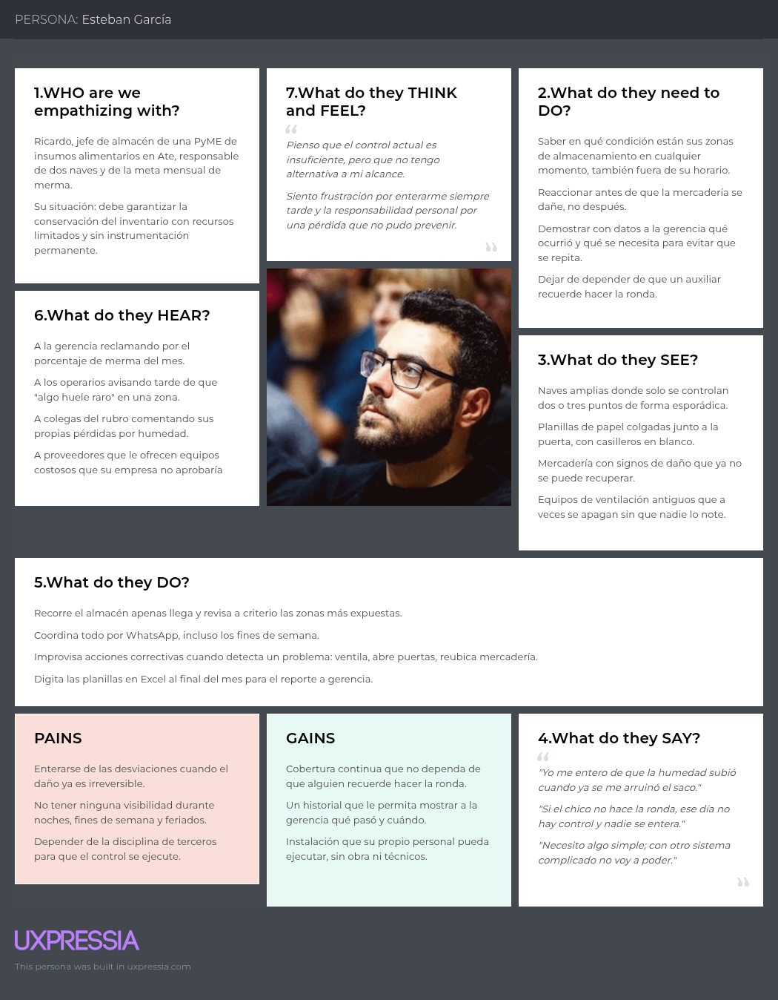
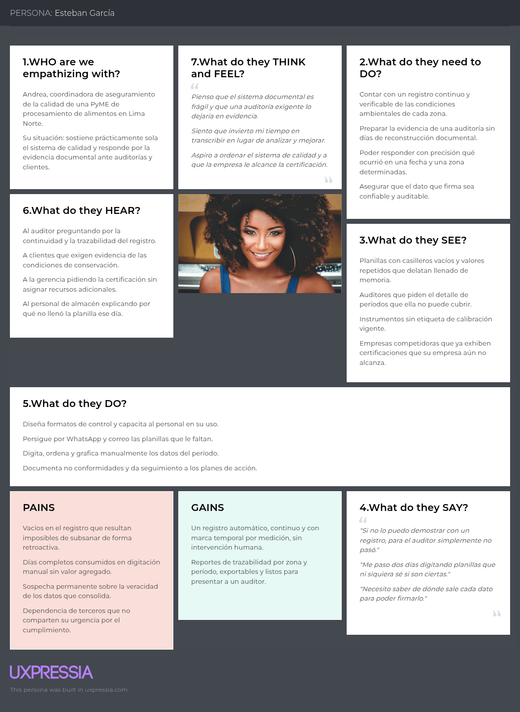
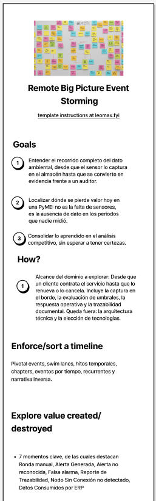

# Capítulo II: Requirements Elicitation & Analysis

## 2.1. Competidores

Se identificaron tres competidores directos cuyo modelo de negocio se sustenta en productos digitales equivalentes además de resultar accesibles, ya sea por venta directa en línea o a través de distribuidores locales.

**UbiBot.** Marca de UbiBot Ltd. especializada en sensores inalámbricos autónomos de temperatura, humedad, luz y vibración con conectividad WiFi, 4G. Los dispositivos se vinculan a la plataforma en la nube UbiBot IoT Platform, que ofrece dashboard web, aplicación móvil iOS/Android, alertas por correo, app y generación de reportes en PDF.

**Monnit (iMonnit).** Fabricante estadounidense que ofrece sensores de temperatura y humedad con certificado de calibración, notificaciones por SMS/correo/llamada y una API para integración. Representa la alternativa de gama profesional accesible.

**Testo Saveris.** Sistema profesional alemán de monitoreo continuo de temperatura y humedad orientado a industria alimentaria, farmacéutica, laboratorios y cadena de frío. Combina sondas radio/Ethernet, una base de datos central y software de trazabilidad. Se comercializa en Perú mediante distribuidores autorizados, con servicios de instalación, calibración certificada y mantenimiento.

---

### 2.1.1. Análisis competitivo

A continuación se presenta el análisis competitivo elaborado por el equipo:

**¿Por qué llevar a cabo este análisis?** Determinar con evidencia si las soluciones de monitoreo ambiental en Perú cubren las tres condiciones que consideramos críticas, con el fin de identificar el espacio real de diferenciación y ajustar la propuesta de valor antes de comprometer el desarrollo.

| Categoría | Aspecto | MachineGuard | UbiBot | Monnit (iMonnit) | Testo Saveris |
|---|---|---|---|---|---|
| **Perfil** | Overview | Plataforma SaaS + IoT peruana para monitoreo continuo de temperatura y humedad en almacenes y plantas de PyMEs.  Nodos ESP32 + DHT22 de bajo costo, un Edge Service que calibra y filtra localmente, una API REST central que evalúa umbrales y una Web App y Mobile App para alertas e historial.  Expone además una API pública para que el ERP del cliente consuma mediciones y alertas sin reemplazar sus sistemas. | Sensores inalámbricos autónomos con WiFi, 4G vinculados a la plataforma en la nube UbiBot.  El usuario configura el dispositivo desde la app y comienza a medir en minutos, sin instalador.  Cobertura funcional amplia con reportes y exportación de datos. | Ecosistema de sensores inalámbricos de largo alcance que reportan a un gateway propietario y de allí a la plataforma iMonnit.  Orientado a monitoreo remoto de instalaciones, equipos e infraestructura crítica en el mercado norteamericano.  Sensores con certificado de calibración y reglas de notificación configurables. | Sistema profesional de monitoreo y documentación de temperatura y humedad para industria alimentaria, farmacéutica y laboratorios.  Se entrega como proyecto llave en mano con instalación, calibración certificada y mantenimiento. |
| **Perfil de Marketing** | Ventaja competitiva: ¿Qué valor ofrece a los clientes? | Monitoreo continuo a un costo de entrada que la PyME puede aprobar.  Continuidad de la medición gracias al buffer del Edge Service.  Integración abierta: el dato llega al ERP que el cliente ya usa, en lugar de obligarlo a mirar un sistema más. | Precio bajo por dispositivo y ausencia de suscripción obligatoria para volúmenes pequeños.  Autonomía total del usuario: compra en línea, configura y opera sin intervención de terceros. | Confiabilidad y alcance: cobertura de naves e instalaciones amplias sin depender del WiFi del cliente.  Trazabilidad respaldada por certificados de calibración y un catálogo de sensores muy extenso. | Precisión metrológica certificada y evidencia documental aceptada por auditores y entes reguladores.  Respaldo de marca, servicio técnico y recalibración periódica. |
| **Perfil de Marketing** | Mercado objetivo | PyMEs de manufactura y almacenaje de Lima. Almacenes de insumos, centros de acopio y plantas de producción de pequeña y mediana escala. | Mercado global de consumo y pequeña empresa: hogares, invernaderos, servidores, tiendas, laboratorios pequeños.  Compra individual o por lotes reducidos, sin segmentación vertical fuerte. | Mediana y gran empresa de Norteamérica y Europa: facilities, retail, agricultura, salud e industria.  Clientes con equipo de TI o mantenimiento propio capaz de desplegar gateways. | Empresas reguladas de alimentos, farmacia, salud y logística de frío que deben demostrar cumplimiento (HACCP, buenas prácticas de almacenamiento, cadena de frío).  Predominantemente mediana y gran empresa. |
| **Perfil de Marketing** | Estrategias de marketing | Landing Page con calculadora de pérdidas evitadas y llamados a la acción diferenciados por segmento.  Marketing de contenidos en LinkedIn y grupos de logística y calidad del Perú.  Alianzas con asociaciones de PyMEs, cámaras de comercio y proveedores locales. | Venta en línea directa y a través de marketplaces internacionales.  Posicionamiento SEO por palabras clave de producto y comparativas.  Reseñas de usuarios y demostraciones en video. | Venta consultiva y red de distribuidores e integradores.  Casos de éxito por industria, webinars y material técnico descargable.  Presencia en ferias sectoriales. | Venta técnica mediante distribuidores autorizados.  Contenido de cumplimiento normativo, guías HACCP y capacitaciones.  Participación en ferias de alimentos, farmacéutica y metrología. |
| **Perfil de Producto** | Productos y servicios | Edge API que calibra, filtra y almacena localmente las lecturas. RESTful API central de usuarios, plantas, zonas, umbrales, alertas e historial. Web App de dashboard en tiempo real e historial. Mobile App con alertas push. Landing Page informativa. | Sensores multivariable con pantalla y batería. Plataforma cloud con dashboard, alertas, exportación y reportes. Apps iOS y Android. API y automatizaciones tipo IFTTT. | Catálogo amplio de sensores inalámbricos ALTA. Gateways ethernet y celulares. Plataforma iMonnit con reglas, notificaciones y reportes. API para integración y servicios de calibración NIST. | Sondas de temperatura y humedad radio y Ethernet. Base de datos y software de análisis y documentación. Servicios de instalación, mapeo térmico, calibración y validación. Alarmas por correo, SMS y relé. |
| **Perfil de Producto** | Precios y costos | S/ 35–50 por punto de monitoreo como costo de hardware.  Suscripción mensual al servicio.  Instalación realizada por el propio personal del cliente con guía asistida. | Costo medio-bajo por dispositivo, con compra única.  Plan de plataforma gratuito con cuotas de almacenamiento y tráfico; planes de pago para mayor volumen y retención.  Costos adicionales de importación, flete y garantía internacional para el comprador peruano. | Costo por sensor superior al de la gama de consumo, más la inversión obligatoria en gateway.  Suscripción a iMonnit por niveles de servicio.  Sin presencia comercial directa en Perú: importación, aranceles y soporte remoto. | Inversión de sistema significativamente alta: sondas, base, software y servicio de puesta en marcha.  Costos recurrentes de recalibración y mantenimiento.  Fuera del alcance presupuestal de la PyME objetivo. |
| **Perfil de Producto** | Canales de distribución (Web y/o Móvil) | Landing Page propia. Web App responsiva. Mobile App Android/iOS. Venta directa y alianzas locales. | Sitio web propio y tienda en línea. Marketplaces internacionales. Apps iOS y Android. | Sitio web propio. Red de distribuidores e integradores. Portal web iMonnit y app móvil. | Sitio web corporativo y distribuidores autorizados en Perú. Software de escritorio y acceso web. Fuerza de venta técnica presencial. |
| **Análisis FODA** | Fortalezas | Costo de entrada por punto sensiblemente menor al de cualquier alternativa importada. Edge Computing propio: calibra, filtra y conserva las lecturas ante caídas de conexión. API pública pensada desde el inicio para integrarse al ERP del cliente. Equipo local: soporte en español, en horario de Perú y con visita presencial posible. | Precio de hardware muy competitivo. Plataforma madura y probada, con app móvil consolidada. Instalación inmediata sin técnico. Multivariable en un solo dispositivo. | Alcance de radio superior al WiFi convencional. Certificación NIST que respalda la medición. Catálogo de sensores muy amplio. Plataforma escalable con API documentada. | Precisión certificada y prestigio de marca. Evidencia documental aceptada en auditorías reguladas. Servicio integral: instalación, calibración y mantenimiento. Distribución establecida en Perú. |
| **Análisis FODA** | Debilidades | Marca nueva y sin historial, lo que genera desconfianza inicial frente a fabricantes establecidos. Sin certificado de calibración trazable en la primera versión. Equipo reducido: capacidad limitada de soporte y de despliegue simultáneo. Dependencia de servicios de terceros para notificaciones. | Si se cae la conexión, el histórico depende del almacenamiento del propio dispositivo. Soporte y garantía desde el exterior; tiempos de reposición largos para el cliente peruano. Integración con ERP no guiada. | Costo por punto elevado para la PyME peruana. Dependencia de un gateway propietario que encarece el despliegue mínimo. Sin canal ni soporte local en Perú. Interfaz y documentación centradas en el mercado anglosajón. | Ciclo de venta e implementación largo. Rigidez: sobredimensionado para un almacén de insumos pequeño. |
| **Análisis FODA** | Oportunidades | Segmento PyME desatendido y numeroso en Lima y provincias. Presión creciente de clientes y auditores por evidencia de condiciones de almacenamiento. Alianzas con proveedores de ERP locales para ofrecer el monitoreo como módulo complementario. Expansión regional a mercados latinoamericanos con la misma brecha de precio. | Crecimiento del mercado de monitoreo doméstico y de pequeña empresa. Entrada a verticales específicas mediante integradores locales. | Expansión hacia mercados emergentes vía distribuidores. Crecimiento del monitoreo de infraestructura crítica y mantenimiento predictivo. | Endurecimiento de la regulación sanitaria y de cadena de frío. Crecimiento de la agroexportación peruana, que exige trazabilidad certificada. |
| **Análisis FODA** | Amenazas | Un competidor establecido puede lanzar una línea de bajo costo con soporte local. Volatilidad del tipo de cambio y de los precios de componentes importados. Fuga de clientes hacia un fabricante certificado apenas la empresa entre a un mercado regulado. | Presión de fabricantes que ofrecen hardware equivalente aún más barato. Cambios en las condiciones del plan gratuito que erosionen su propuesta. | Competencia de plataformas cloud generalistas con hardware genérico. Barreras arancelarias y logísticas en mercados fuera de su red. | Aparición de alternativas de bajo costo que alcancen precisión suficiente para cumplir la norma. Presión de precio en licitaciones de mediana empresa. |

*Tabla 1. Competitive Analysis Landscape de MachineGuard frente a sus competidores directos.*

---

### 2.1.2. Estrategias y tácticas frente a competidores

| Categoría | Estrategias y Tácticas |
|---|---|
| **Oportunidades** | <ul><li>Presión creciente de clientes y auditores por evidencia documentada de las condiciones de almacenamiento.</li><li>Disponibilidad de proveedores de ERP locales interesados en ampliar su oferta.</li><li>Expansión regional a mercados latinoamericanos con la misma brecha de precio.</li></ul> |
| **Amenazas** | <ul><li>Un fabricante establecido puede lanzar una línea de bajo costo con soporte local.</li><li>Volatilidad del tipo de cambio y del precio de componentes importados.</li><li>Fuga de clientes hacia un fabricante certificado al ingresar a un mercado regulado.</li></ul> |
| **Fortalezas** | <ul><li>API pública diseñada desde el inicio para integrarse con el ERP del cliente.</li><li>Equipo local: soporte en español, en horario de Perú y con visita presencial posible.</li><li>Conocimiento directo del contexto operativo de la PyME limeña.</li></ul> |
| **Debilidades** | <ul><li>Marca nueva y sin historial frente a fabricantes consolidados.</li><li>Sensores DHT22 con menor exactitud y sin certificado de calibración trazable en la primera versión.</li><li>Equipo reducido: capacidad limitada de soporte y de despliegue simultáneo.</li><li>Dependencia de servicios de terceros para el envío de notificaciones.</li></ul> |
| **Estrategias FO** (Ofensivas) | <ul><li>Penetración por costo en el nicho desatendido: publicar precios por punto de forma abierta en la Landing Page, incluyendo el costo total del primer año.</li><li>Paquete de arranque de dos puntos de monitoreo con instalación asistida y sin costo de puesta en marcha.</li><li>Alianzas de integración con proveedores de ERP peruanos, ofreciendo el monitoreo como módulo complementario.</li><li>Documentar y publicar la API pública con ejemplos de consumo listos para usar.</li><li>Campañas dirigidas a empresas industriales de Lima.</li></ul> |
| **Estrategias FA** (Defensivas) | <ul><li>Blindaje por continuidad: comunicar y demostrar la autonomía del Edge Service ante cortes de internet, en la venta y en el video About-the-Product.</li><li>Demostración cuantificada contra la ronda manual: calculadora de merma evitada en la Landing Page.</li><li>Mostrar en el dashboard el estado de conectividad y la última sincronización de cada nodo, como señal de confianza.</li><li>Fortalecimiento de marca mediante soporte en español, en horario local y con respuesta presencial.</li></ul> |
| **Estrategias DO** (Reorientación) | <ul><li>Construcción acelerada de confianza: piloto gratuito de 30 días, casos documentados y testimonios que compensen la falta de historial de marca.</li><li>Hoja de ruta hacia la trazabilidad certificada: incorporar un nodo de mayor exactitud con calibración trazable para clientes en proceso de certificación.</li><li>Reducción de la fricción de adopción: nodo preconfigurado, vinculación guiada desde la app móvil y guías de instalación en español.</li><li>Umbrales sugeridos por tipo de producto, para que el cliente no parta de una configuración en blanco.</li></ul> |
| **Estrategias DA** (Supervivencia) | <ul><li>Retención por dependencia positiva: el histórico acumulado y la integración ya operativa en el ERP elevan el costo de cambiar de proveedor.</li><li>Cobertura del riesgo cambiario: diseño con componentes sustituibles y proveedores alternos, sin depender de un solo importador.</li><li>Diversificación de ingresos mediante un servicio recurrente de verificación y recalibración de nodos.</li><li>Transparencia declarada sobre la exactitud del sensor y sus usos apropiados, para no sobreprometer ante el segmento de control de calidad.</li></ul> |

*Tabla 2. Estrategias y tácticas de MachineGuard frente a sus competidores.*

---

## 2.2. Entrevistas

### 2.2.1. Diseño de entrevistas

#### Segmento 1: Jefes de Almacén

**A. Preguntas de presentación**

1. ¿Cuál es su cargo actual y desde hace cuánto tiempo lo ocupa?
2. ¿A qué se dedica la empresa y aproximadamente cuántas personas trabajan en ella?

**B. Entrevista**

1. ¿Qué tipo de mercadería o insumos almacena y cuáles son sensibles a la temperatura o la humedad?
2. ¿Cómo se controla hoy la temperatura y la humedad en esas zonas?
3. ¿Con qué frecuencia se realiza ese control y en qué momentos del día?
4. ¿Dónde queda registrada esa medición? ¿Qué se hace después con ese registro?
5. ¿Qué ocurre cuando la persona encargada de la ronda falta, está ocupada o se olvida de hacerla?

#### Segmento 2: Encargados de Control de Calidad

**A. Preguntas de presentación**

1. ¿Desde hace cuánto tiempo trabaja en aseguramiento o control de la calidad?
2. ¿Qué tipo de producto elabora o almacena la empresa y bajo qué normas o certificaciones trabaja?

**B. Entrevista**

1. ¿Cómo gestionan actualmente el registro de las condiciones ambientales en sus zonas de almacenamiento?
2. ¿Quién es responsable de tomar el dato y quién de consolidarlo?
3. ¿Cuáles son los mayores retos que enfrentan al sustentar esas condiciones ante una auditoría?
4. ¿Cuánto tiempo les toma preparar el reporte de condiciones ambientales de un período?
5. ¿Tienen acceso a dispositivos móviles o computadoras para registrar y consultar esa información?
6. Si tuvieran acceso a una plataforma que genere automáticamente el historial de condiciones, ¿qué funcionalidades considerarían indispensables?

---

### 2.2.2. Registro de entrevistas

#### Segmento 1: Jefes de Almacén

**Entrevista #1**

- **Entrevistado:** Elena Vargas — 44 años, Villa El Salvador. Coordinadora de Operaciones y Almacén en una distribuidora de productos veterinarios y nutrición animal (~90 trabajadores). 7 años en el puesto, 11 en la empresa.
- **Duración:** 3:37 min
- **Enlace:** [Entrevista Elena Vargas](https://drive.google.com/file/d/1HEwKPIfimZ4nDUr92sj5H-TA43uI-iDM/view?usp=sharing)
- **Resumen:** Elena Vargas gestiona insumos altamente sensibles a la temperatura: vacunas y biológicos que deben mantenerse entre 2 °C y 8 °C en cámara, además de premezclas y vitaminas que requieren un rango de 15 °C a 28 °C. Si bien la organización cuenta con procedimientos formales. La vulnerabilidad principal que identifica es la ausencia de cobertura fuera del horario regular. Al no existir registro continuo, tampoco pudo sustentar ante gerencia qué había ocurrido. Su necesidad se orienta, por tanto, a un monitoreo continuo con alertas remotas en tiempo real y evidencia histórica que permita responder a tiempo y rendir cuentas del incidente.

**Entrevista #2**

- **Entrevistado:** Marco Zevallos — Jefe de Almacén de una panadería y pastelería. 4 años en el puesto, previamente auxiliar. (Edad y distrito no declarados en la entrevista.)
- **Duración:** 2:50 min
- **Enlace:** [Entrevista Marcos Zevallos](https://drive.google.com/file/d/1MwtaL3PfKFhnvhP2l6xhRz0lqNBeMAwV/view?usp=sharing)
- **Resumen:** Marco Zevallos administra insumos como harina, azúcar, levadura, mejoradores y manteca en un equipo reducido distribuido entre almacén, reparto y oficina, siendo la levadura y la harina los más críticos: la harina absorbe humedad y deja de ser vendible. A diferencia de un entorno con procedimientos establecidos, aquí el control es prácticamente informal: no existe un sistema de climatización y el único higrómetro disponible fue comprado por él mismo, se encuentra averiado y arroja lecturas inconsistentes, por lo que el equipo termina guiándose por la percepción sensorial del ambiente.
  

#### Segmento 2: Encargados de Control de Calidad

**Entrevista #1**

- **Link:**
- **Entrevistado:**
- **Duración:**
- **Resumen:**

---

### 2.2.3. Análisis de entrevistas

#### Segmento 1: Jefes de Almacén

**Datos demográficos**

- Entrevistados: 2
- Cargos: Coordinadora de Operaciones y Almacén, Jefe de Almacén
- Rubros: distribución de productos veterinarios y nutrición animal; panadería y pastelería

**Estadísticas**

- El 100% almacena insumos sensibles a temperatura y/o humedad.
- El 100% registra las mediciones en formato físico (papel), sin digitalización automática.
- El 100% reportó pérdida efectiva de mercadería por no detectar a tiempo una desviación.
- El 50% dispone de alarma, pero únicamente sonora y local, sin notificación remota.
- El 50% opera con instrumentos de medición averiados o no calibrados.

**Funcionalidades requeridas **

- Monitoreo continuo y automático de temperatura y humedad (100%).
- Alertas remotas en tiempo real al celular del responsable, con escalamiento fuera de turno (100%).
- Registro histórico digital y trazabilidad de incidentes para rendición de cuentas (100%).
- Configuración de rangos por tipo de zona o producto —cadena de frío vs. almacén seco— (100%).
- Reportes automáticos que reemplacen la transcripción manual a Excel (50%).

**Conclusiones y recomendaciones**

- El punto crítico no es la medición en sí, sino la ausencia de detección y notificación cuando no hay personal presente.
- Omisión de la ronda y pérdida de trazabilidad para sustentar lo ocurrido ante la gerencia.
- La solución debe cubrir tanto entornos con procedimientos formales pero desconectados como entornos informales sin instrumentación confiable, lo que exige bajo costo, instalación simple y autonomía frente a la intervención humana.

#### Segmento 2: Encargados de Control de Calidad

> Contenido pendiente.

## 2.3. Needfinding

En esta sección analizamos la información recopilada en las entrevistas realizadas a nuestros segmentos objetivos.

### 2.3.1. User Personas

Se elaboró una ficha de User Persona por cada segmento objetivo:

#### User Persona 1 — Segmento: Jefes de Almacén y Gerentes de Operaciones

#### User Persona 2 — Segmento: Encargados de Control de Calidad

---

### 2.3.2. User Task Matrix

| Tarea (User Task) | Esteban García · Frecuencia | Esteban García · Importancia | Micaela Suárez · Frecuencia | Micaela Suárez · Importancia |
|---|:---:|:---:|:---:|:---:|
| Verificar las condiciones de temperatura y humedad de las zonas de almacenamiento | Alta | Alta | Media | Alta |
| Registrar la lectura ambiental en una planilla o formato de control | Alta | Media | Media | Alta |
| Detectar una condición fuera del rango permitido y comunicarla | Media | Alta | Baja | Alta |
| Coordinar y ejecutar la acción correctiva (ventilar, ajustar climatización, reubicar mercadería) | Media | Alta | Baja | Media |
| Verificar el funcionamiento y la calibración de los instrumentos de medición | Baja | Media | Media | Alta |
| Supervisar y capacitar al personal en el procedimiento de control ambiental | Media | Media | Media | Alta |
| Consolidar el histórico de mediciones del período | Baja | Media | Alta | Alta |
| Elaborar el reporte de condiciones ambientales para la gerencia | Media | Media | Alta | Media |
| Preparar la evidencia documental | Baja | Media | Alta | Alta |

*Tabla 3. User Task Matrix de los segmentos objetivo de MachineGuard.*

---

### 2.3.3. User Journey Mapping

#### User Persona 1 — Segmento: Jefes de Almacén y Gerentes de Operaciones

*Tabla 4. User Journey Map As-Is de Esteban García (Jefe de Almacén).*

#### User Persona 2 — Segmento: Encargados de Control de Calidad

*Tabla 5. User Journey Map As-Is de Micaela Suárez (Encargada de Control de Calidad).*

---

### 2.3.4. Empathy Mapping

#### User Persona 1 — Segmento: Jefes de Almacén y Gerentes de Operaciones

*Tabla 6. Empathy Map del User Persona Esteban García.*

#### User Persona 2 — Segmento: Encargados de Control de Calidad

*Tabla 7. Empathy Map del User Persona Micaela Suárez.*

---

### 2.3.5. As-Is Scenario Mapping

#### As-Is Scenario Map — Esteban García, Jefe de Almacén

| FASES | Inicio de turno | Ronda de inspección | Detección de la desviación | Respuesta y acción correctiva | Registro y cierre del día |
|---|---|---|---|---|---|
| **DOING** | Llego temprano y recorro las dos naves antes de que entre el turno. Reviso a ojo si algo se ve húmedo o si el ambiente está cargado. Verifico que los equipos de ventilación quedaron encendidos. | Le pido al auxiliar de turno que tome la lectura con el termohigrómetro. Se miden dos o tres puntos de referencia, no toda la nave. Anota los valores en la planilla colgada junto a la puerta. | Un operario me avisa que hay sacos con signos de humedad. Voy al punto, mido y confirmo que está fuera de rango. Reviso la planilla y encuentro casilleros en blanco de las horas previas. | Enciendo o ajusto la ventilación y abro puertas para airear. Reubico la mercadería comprometida a otra zona. Llamo al técnico si el equipo de climatización falló. | Completo la planilla del día, a veces reconstruyendo de memoria. Aviso por WhatsApp al grupo del equipo. Archivo la hoja en el file y digito los datos en Excel a fin de mes. |
| **THINKING** | *"¿Habrá pasado algo anoche que nadie vio?"* *"Con este calor, la zona del fondo siempre es la que sufre."* | *"Dos puntos no representan toda la nave."* *"Si hoy el chico no hace la ronda, no me entero de nada."* | *"¿Desde cuándo está así? No tengo cómo saberlo."* *"Otra vez me entero cuando ya no hay nada que hacer."* | *"Tengo que salvar lo que se pueda antes de que avance."* *"¿Y cómo confirmo que ya volvió a la normalidad?"* | *"No sé si estos números son de la hora que dice la planilla."* *"Sin datos, la merma va a parecer descuido mío."* |
| **FEELING** | Expectativa mezclada con inquietud Alerta por lo que no puede ver | Resignación ante un control que sabe incompleto Inseguridad por depender de otra persona | Frustración e impotencia Sensación de llegar siempre tarde | Presión y urgencia Improvisación, sin certeza del resultado | Cansancio y escepticismo sobre el valor del registro Exposición ante la gerencia |

*Tabla 8. As-Is Scenario Map de Esteban García (Jefe de Almacén).*

#### As-Is Scenario Map — Micaela Suárez, Encargada de Control de Calidad

| FASES | Definición de estándares | Recolección de registros | Consolidación y digitación | Detección de vacíos | Auditoría y cierre |
|---|---|---|---|---|---|
| **DOING** | Reviso la normativa vigente y las fichas técnicas de cada producto. Defino los rangos aceptables de temperatura y humedad por zona. Diseño el formato de control y capacito al personal en su llenado. | Solicito a almacén y producción las planillas del período. Recibo hojas físicas, algunas incompletas o ilegibles. Insisto por WhatsApp y correo por las que faltan. | Digito planilla por planilla en mi hoja de cálculo. Ordeno las lecturas por fecha y por zona. Armo los gráficos de tendencia del período. | Identifico días sin ningún registro y turnos sin cobertura. Detecto valores idénticos repetidos que delatan llenado de memoria. Consulto al personal qué ocurrió esos días. | Presento la carpeta de evidencias al auditor. Respondo preguntas sobre períodos específicos. Redacto la no conformidad y el plan de acción cuando hay observación. |
| **THINKING** | *"El formato está bien hecho; el problema será que lo cumplan."* *"Esto solo funciona si alguien lo llena todos los días."* | *"Otra vez tengo que perseguir hojas que deberían llegarme solas."* *"¿Y los días que faltan cómo los explico?"* | *"Estoy transcribiendo datos que ni siquiera sé si son ciertos."* *"Dos días completos en algo que debería ser automático."* | *"Estas lecturas son demasiado parejas para ser reales."* *"Si preguntan por esta semana, no tengo con qué responder."* | *"Ojalá no pida el detalle de las noches ni de los fines de semana."* *"Todo mi trabajo del período se juega en esta hora."* |
| **FEELING** | Motivación y sentido de propósito Confianza en el procedimiento que diseñó | Fastidio por depender de terceros Impaciencia | Agotamiento Sensación de trabajo estéril | Preocupación y vulnerabilidad Desconfianza sobre el dato que debe firmar | Tensión y exposición Resignación al saber que se repetirá |

*Tabla 9. As-Is Scenario Map de Micaela Suárez (Encargada de Control de Calidad).*

---

## 2.4. Big Picture EventStorming

*Figura 1. Lienzo consolidado del Big Picture EventStorming de MachineGuard.*

---

## 2.5. Ubiquitous Language

Estos son los términos y conceptos comunes utilizados en nuestro proyecto:

| Término (Term) | Definición |
|---|---|
| **Monitored Facility** (Instalación monitoreada) | Sede física del cliente —planta de producción, almacén o centro de acopio— dentro de la cual se despliega el servicio de monitoreo. Una instalación agrupa una o más zonas de monitoreo. |
| **Monitoring Zone** (Zona de monitoreo) | Espacio delimitado dentro de una instalación que comparte un mismo comportamiento ambiental esperado y un mismo conjunto de umbrales, por ejemplo una cámara, un pasillo de estantería o una sala de acondicionamiento. |
| **Monitoring Point** (Punto de monitoreo) | Ubicación específica dentro de una zona donde se instala un nodo sensor. Es la unidad sobre la que se calcula el precio del servicio. |
| **Sensor Node** (Nodo sensor) | Dispositivo instalado en un punto de monitoreo que captura de forma periódica los valores de las variables ambientales de ese punto. |
| **Environmental Variable** (Variable ambiental) | Magnitud física del entorno cuya evolución afecta la conservación del producto almacenado. En el alcance actual: temperatura y humedad relativa. |
| **Reading** (Lectura) | Valor bruto capturado por un nodo sensor en un instante determinado, antes de ser calibrado o validado. |
| **Measurement** (Medición) | Lectura ya calibrada y validada, asociada a un punto de monitoreo y a una marca temporal, que se incorpora al historial del cliente. |
| **Sampling Interval** (Intervalo de muestreo) | Tiempo que transcurre entre dos capturas consecutivas de un mismo nodo sensor. Determina la resolución del historial y la rapidez con que puede detectarse una desviación. |
| **Calibration** (Calibración) | Procedimiento mediante el cual se contrasta la respuesta de un nodo sensor contra una referencia conocida y se determina el ajuste que debe aplicarse a sus lecturas. |
| **Calibration Offset** (Ajuste de calibración) | Corrección que se aplica a la lectura bruta de un nodo para obtener la medición definitiva, resultante del procedimiento de calibración. |
| **Threshold** (Umbral) | Valor límite, superior o inferior, definido para una variable ambiental dentro de una zona. Su cruce constituye el hecho que da origen a una alerta. |
| **Safe Range** (Rango seguro) | Intervalo comprendido entre el umbral inferior y el superior de una variable, dentro del cual las condiciones se consideran adecuadas para el producto almacenado. |
| **Deviation** (Desviación) | Situación en la que una medición se sitúa fuera del rango seguro definido para su zona. |
| **Excursion** (Excursión) | Período completo durante el cual una variable permaneció fuera del rango seguro, delimitado por el momento en que salió y aquel en que retornó. Es la unidad que se evalúa en una auditoría, más que la medición aislada. |
| **Alert** (Alerta) | Aviso generado por el sistema al detectarse una desviación, dirigido a los responsables de la zona afectada. |
| **Alert Severity** (Severidad de la alerta) | Nivel de criticidad asignado a una alerta según la magnitud de la desviación y el tiempo que lleva sostenida. |
| **Acknowledgement** (Reconocimiento) | Acto por el cual un responsable declara haber tomado conocimiento de una alerta, quedando registrados su identidad y el momento en que lo hizo. |
| **Escalation** (Escalamiento) | Elevación de una alerta hacia un responsable de mayor jerarquía cuando no ha sido reconocida dentro del plazo previsto. |
| **Corrective Action** (Acción correctiva) | Intervención ejecutada para devolver una zona a su rango seguro, como ajustar la climatización, ventilar o reubicar la mercadería. |
| **Incident** (Incidente) | Registro consolidado de una excursión: incluye la desviación detectada, la alerta generada, su reconocimiento, la acción correctiva aplicada y su resultado. |
| **Shrinkage** (Merma) | Pérdida de producto o insumo atribuible a condiciones ambientales fuera de rango, expresada en unidades o en valor monetario. |
| **Non-conforming Product** (Producto no conforme) | Producto que, por haber estado expuesto a condiciones fuera de rango, no cumple los requisitos de calidad establecidos y debe ser separado, reprocesado o descartado. |
| **Batch** (Lote) | Conjunto de unidades de producto elaboradas o recibidas bajo las mismas condiciones, que constituye la unidad de trazabilidad frente a un cliente o un auditor. |
| **Traceability** (Trazabilidad) | Capacidad de reconstruir las condiciones ambientales a las que estuvo expuesto un producto durante todo el período en que permaneció almacenado. |
| **Measurement History** (Historial de mediciones) | Serie temporal completa e íntegra de las mediciones de un punto de monitoreo, conservada durante el período de retención contratado. |
| **Traceability Report** (Reporte de trazabilidad) | Documento generado a partir del historial que resume las condiciones de una zona en un período determinado, junto con las excursiones ocurridas y su tratamiento. Es la evidencia que se presenta en una auditoría. |
| **Audit** (Auditoría) | Revisión, interna o externa, en la que se verifica que la empresa cumple los estándares comprometidos, incluida la conservación adecuada de sus productos. |
| **Non-conformity** (No conformidad) | Hallazgo formal de una auditoría que señala el incumplimiento de un requisito y obliga a la empresa a ejecutar y documentar un plan de acción. |
| **Inspection Round** (Ronda de inspección) | Recorrido manual periódico en el que un operario mide las condiciones ambientales con un instrumento portátil y las anota en un formato. Es el procedimiento vigente que la solución sustituye. |
| **Thermohygrometer** (Termohigrómetro) | Instrumento portátil de medición puntual de temperatura y humedad relativa, utilizado en las rondas de inspección manuales. |
| **Cold Chain** (Cadena de frío) | Secuencia ininterrumpida de etapas de almacenamiento y transporte en condiciones controladas de temperatura que debe mantener un producto sensible desde su origen hasta su destino. |
| **Offline Node** (Nodo sin conexión) | Nodo sensor que ha dejado de reportar mediciones dentro del intervalo esperado, lo que genera un vacío en el historial de su punto de monitoreo. |
| **Subscription Plan** (Plan de suscripción) | Modalidad contratada por el cliente que determina el número de puntos de monitoreo habilitados, el período de retención del historial y los canales de notificación disponibles. |
| **Retention Period** (Período de retención) | Tiempo durante el cual el historial de mediciones permanece disponible para consulta y exportación, según el plan contratado. |

*Tabla 13. Ubiquitous Language del dominio de MachineGuard.*

| Criterio Específico | Acciones Realizadas | Conclusiones |
|---|---|---|
| Comunica oralmente con efectividad a diferentes rangos de audiencia. | **Diego Seijas Vasquez** AV1: Preparé y expuse las diapositivas correspondientes al diseño táctico de los Bounded Contexts Edge Processing y Traceability & Quality, apoyándome en los diagramas de componentes y de clases del dominio elaborados para cada uno. Ajusté el nivel de detalle técnico al tiempo asignado, priorizando las decisiones de diseño que diferencian a cada contexto por sobre la enumeración exhaustiva de sus clases.  **Pedro Omar Lecca Villalobos** AV1: Preparé y expuse las diapositivas del Capítulo III —User Stories, Impact Mapping y Product Backlog— y las del diseño táctico del Bounded Context IAM. Estructuré cada bloque partiendo de la decisión de diseño y su justificación antes de describir el modelo, y ajusté la profundidad técnica al tiempo asignado, priorizando las reglas de negocio con consecuencias de diseño —el aislamiento multi-tenant y la protección del último administrador activo— por encima de la enumeración de clases y endpoints. Elaboré además el guion de la exposición para sostener la misma terminología del informe durante la presentación.   **Camilla Leonor Espinoza Vivas** AV1:Preparé las diapositivas correspondientes al diseño táctico de los Bounded Contexts Alert & Incident Management y Environmental Monitoring, sintetizando su rol dentro de MachineGuard, integración con otros contextos, Domain Layer, capas de la solución, flujos principales y reglas de negocio. Organicé la exposición partiendo del problema que resuelve cada contexto y posteriormente expliqué sus decisiones de diseño, utilizando los diagramas de componentes, clases de dominio y base de datos como soporte visual para comunicar la arquitectura de forma clara y progresiva.  **Sandro Ernesto Dinklange Arevalo** AV1: Preparé y expuse las diapositivas del Capítulo II —análisis de competidores, estrategias y tácticas, User Personas, User Journey Mapping y Empathy Mapping—, organizando la exposición desde el problema observado en campo hacia los artefactos que lo sintetizan. Ajusté el contenido al tiempo asignado, priorizando la voz de los arquetipos Esteban García y Micaela Suárez por encima de la lectura de tablas. Diseñé además los guiones de entrevista de ambos segmentos y conduje las entrevistas a jefes de almacén, adaptando el lenguaje del monitoreo IoT a interlocutores sin formación técnica.  *Pendiente: aportes del resto del equipo.* | **Diego Seijas Vasquez** AV1: Verifiqué que una audiencia mixta —el docente y compañeros que trabajaron otros Bounded Contexts— sigue mejor la exposición cuando se plantea primero el problema que resuelve el contexto y recién después su modelo. Explicar el porqué antes que el cómo permitió transmitir las decisiones de arquitectura dentro del tiempo disponible.  **Pedro Omar Lecca Villalobos** AV1: Comprobé que explicar el criterio de priorización del Product Backlog —situar el Landing Page por delante del monitoreo para validar el mercado antes de comprometer esfuerzo en hardware— resultó más convincente que exponer el listado ordenado de historias. Asimismo, declarar en voz alta las limitaciones asumidas en IAM, como la vigencia de un access token ya emitido frente a la revocación, aportó más credibilidad ante una audiencia técnica que presentar únicamente las capacidades del contexto.  **Camilla Leonor Espinoza Vivas** AV1:Comprobé que una explicación técnica es más clara cuando se presenta primero la responsabilidad de cada Bounded Context y luego se profundiza progresivamente en sus capas, flujos y diagramas. Utilizar ejemplos como DeviationDetected, el ciclo de una alerta y la evaluación de Measurements permitió relacionar las decisiones de arquitectura con escenarios reales de MachineGuard y facilitar su comprensión ante una audiencia con distinto nivel técnico.  **Sandro Ernesto Dinklange Arevalo** AV1: Comprobé que citar las frases textuales de los arquetipos —como «me entero de que la humedad subió cuando ya se me arruinó el saco»— transmite la necesidad del usuario más rápido que describirla, lo que permitió abarcar cinco artefactos en el tiempo asignado. En las entrevistas verifiqué que la información más valiosa surge al pedir al entrevistado que relate un caso concreto, y no al preguntarle por la solución: la imposibilidad de sustentar ante gerencia qué ocurrió fuera del horario regular reveló la necesidad real mejor que cualquier pregunta directa sobre alertas.  *Pendiente: aportes del resto del equipo.* |
| Comunica por escrito con efectividad a diferentes rangos de audiencia. | **Diego Seijas Vasquez** AV1: Redacté las secciones 4.2.3 (Edge Processing) y 4.2.4 (Traceability & Quality) del Capítulo IV, documentando para cada Bounded Context sus cuatro capas, sus reglas de negocio, sus flujos principales y sus limitaciones. Elaboré además los diagramas de componentes, de clases del dominio y de diseño de base de datos de ambos contextos, versionando sus fuentes PlantUML en `assets/diagrams/chapter-4/` para que el equipo pueda regenerarlos. Completé también mi perfil de integrante en la sección 1.1.2.  **Pedro Omar Lecca Villalobos** AV1: Redacté íntegramente el Capítulo III: las 15 User Stories y 5 Technical Stories organizadas en 6 épicas con criterios de aceptación en formato Gherkin, el Impact Mapping con sus cuatro Business Goals SMART y sus Impact Maps por objetivo, y el Product Backlog de 20 ítems y 93 Story Points, migrando además su gestión a Jira. En el Capítulo IV documenté la sección 4.2.1 (IAM) con sus cuatro capas, sus reglas de negocio, sus tres flujos principales y sus limitaciones de seguridad, acompañada de los diagramas de componentes, de clases del dominio y de diseño de base de datos alojados en `assets/img/chapter-4/BC IAM/`. Completé también mi perfil de integrante en la sección 1.1.2.   **Camilla Leonor Espinoza Vivas** AV1:Redacté las secciones 4.2.5 (Alert & Incident Management) y 4.2.6 (Environmental Monitoring) del Capítulo IV, documentando para ambos Bounded Contexts sus capas Domain, Interface, Application e Infrastructure, agregados, entidades, Value Objects, servicios, repositorios, reglas de negocio y flujos principales. Elaboré además sus diagramas de componentes, clases del dominio y diseño de base de datos mediante PlantUML, manteniendo consistencia con la arquitectura general de MachineGuard, el Context Mapping y el Ubiquitous Language definido por el equipo.  **Sandro Ernesto Dinklange Arevalo** AV1: Redacté el Capítulo II (secciones 2.1 a 2.5): el Competitive Analysis Landscape frente a UbiBot, Monnit y Testo Saveris con su matriz de estrategias FO, FA, DO y DA; el diseño y registro de entrevistas; el User Task Matrix; el As-Is Scenario Mapping; el Big Picture EventStorming y el Ubiquitous Language con 34 términos del dominio. Elaboré en UXPressia las fichas de User Persona, los User Journey Maps y los Empathy Maps de ambos segmentos, y organicé sus evidencias gráficas en `assets/img/chapter-2/` para referenciarlas desde el informe.  *Pendiente: aportes del resto del equipo.* | **Diego Seijas Vasquez** AV1: Sostener el mismo Ubiquitous Language y la misma estructura de subsecciones que el resto del equipo resultó decisivo para que el Capítulo IV se lea como un documento único y no como aportes independientes. Documentar las limitaciones de cada contexto, y no solo sus capacidades, aportó más valor al lector técnico que extender la descripción del modelo.  **Pedro Omar Lecca Villalobos** AV1: Verifiqué que escribir el escenario de borde dentro de cada User Story, y no solo el camino esperado, convierte el criterio de aceptación en una prueba verificable y reduce la ambigüedad para quien implemente la historia. En el Capítulo IV constaté que documentar la razón de cada decisión —por qué `User` referencia a `Organization` por identificador, o por qué `Role` es un Value Object sin tabla propia— hace que el diseño se sostenga ante la revisión, mientras que describir solo la estructura obliga al lector a reconstruir el porqué.  **Camilla Leonor Espinoza Vivas** AV1:Verifiqué que documentar un Bounded Context exige mantener coherencia entre el diseño estratégico, las reglas de negocio, las capas de software y los diagramas técnicos. Desarrollar Alert & Incident Management y Environmental Monitoring con una estructura y terminología uniforme permitió que sus responsabilidades, integraciones y decisiones de diseño puedan entenderse y reconstruirse sin depender únicamente de los diagramas o del código.  **Sandro Ernesto Dinklange Arevalo** AV1: Verifiqué que un artefacto de Needfinding solo resulta creíble si cada característica puede rastrearse hasta una entrevista concreta, y que declarar lo que aún falta validar aporta más solidez al capítulo que ampliar su volumen. Constaté además que describir el escenario actual sin la solución obliga a justificar cada funcionalidad desde un problema observado, y que mantener la misma nomenclatura entre el texto del informe y las imágenes de UXPressia es tan determinante para el lector como el contenido mismo.  *Pendiente: aportes del resto del equipo.* |

| Criterio Específico | Acciones Realizadas | Conclusiones |
|---|---|---|
| Comunica oralmente con efectividad a diferentes rangos de audiencia. | **Diego Seijas Vasquez** AV1: Preparé y expuse las diapositivas correspondientes al diseño táctico de los Bounded Contexts Edge Processing y Traceability & Quality, apoyándome en los diagramas de componentes y de clases del dominio elaborados para cada uno. Ajusté el nivel de detalle técnico al tiempo asignado, priorizando las decisiones de diseño que diferencian a cada contexto por sobre la enumeración exhaustiva de sus clases.  **Pedro Omar Lecca Villalobos** AV1: Preparé y expuse las diapositivas del Capítulo III —User Stories, Impact Mapping y Product Backlog— y las del diseño táctico del Bounded Context IAM. Estructuré cada bloque partiendo de la decisión de diseño y su justificación antes de describir el modelo, y ajusté la profundidad técnica al tiempo asignado, priorizando las reglas de negocio con consecuencias de diseño —el aislamiento multi-tenant y la protección del último administrador activo— por encima de la enumeración de clases y endpoints. Elaboré además el guion de la exposición para sostener la misma terminología del informe durante la presentación.   **Camilla Leonor Espinoza Vivas** AV1:Preparé las diapositivas correspondientes al diseño táctico de los Bounded Contexts Alert & Incident Management y Environmental Monitoring, sintetizando su rol dentro de MachineGuard, integración con otros contextos, Domain Layer, capas de la solución, flujos principales y reglas de negocio. Organicé la exposición partiendo del problema que resuelve cada contexto y posteriormente expliqué sus decisiones de diseño, utilizando los diagramas de componentes, clases de dominio y base de datos como soporte visual para comunicar la arquitectura de forma clara y progresiva.  *Pendiente: aportes del resto del equipo.* | **Diego Seijas Vasquez** AV1: Verifiqué que una audiencia mixta —el docente y compañeros que trabajaron otros Bounded Contexts— sigue mejor la exposición cuando se plantea primero el problema que resuelve el contexto y recién después su modelo. Explicar el porqué antes que el cómo permitió transmitir las decisiones de arquitectura dentro del tiempo disponible.  **Pedro Omar Lecca Villalobos** AV1: Comprobé que explicar el criterio de priorización del Product Backlog —situar el Landing Page por delante del monitoreo para validar el mercado antes de comprometer esfuerzo en hardware— resultó más convincente que exponer el listado ordenado de historias. Asimismo, declarar en voz alta las limitaciones asumidas en IAM, como la vigencia de un access token ya emitido frente a la revocación, aportó más credibilidad ante una audiencia técnica que presentar únicamente las capacidades del contexto.  **Camilla Leonor Espinoza Vivas** AV1:Comprobé que una explicación técnica es más clara cuando se presenta primero la responsabilidad de cada Bounded Context y luego se profundiza progresivamente en sus capas, flujos y diagramas. Utilizar ejemplos como DeviationDetected, el ciclo de una alerta y la evaluación de Measurements permitió relacionar las decisiones de arquitectura con escenarios reales de MachineGuard y facilitar su comprensión ante una audiencia con distinto nivel técnico.  *Pendiente: aportes del resto del equipo.* |
| Comunica por escrito con efectividad a diferentes rangos de audiencia. | **Diego Seijas Vasquez** AV1: Redacté las secciones 4.2.3 (Edge Processing) y 4.2.4 (Traceability & Quality) del Capítulo IV, documentando para cada Bounded Context sus cuatro capas, sus reglas de negocio, sus flujos principales y sus limitaciones. Elaboré además los diagramas de componentes, de clases del dominio y de diseño de base de datos de ambos contextos, versionando sus fuentes PlantUML en `assets/diagrams/chapter-4/` para que el equipo pueda regenerarlos. Completé también mi perfil de integrante en la sección 1.1.2.  **Pedro Omar Lecca Villalobos** AV1: Redacté íntegramente el Capítulo III: las 15 User Stories y 5 Technical Stories organizadas en 6 épicas con criterios de aceptación en formato Gherkin, el Impact Mapping con sus cuatro Business Goals SMART y sus Impact Maps por objetivo, y el Product Backlog de 20 ítems y 93 Story Points, migrando además su gestión a Jira. En el Capítulo IV documenté la sección 4.2.1 (IAM) con sus cuatro capas, sus reglas de negocio, sus tres flujos principales y sus limitaciones de seguridad, acompañada de los diagramas de componentes, de clases del dominio y de diseño de base de datos alojados en `assets/img/chapter-4/BC IAM/`. Completé también mi perfil de integrante en la sección 1.1.2.   **Camilla Leonor Espinoza Vivas** AV1:Redacté las secciones 4.2.5 (Alert & Incident Management) y 4.2.6 (Environmental Monitoring) del Capítulo IV, documentando para ambos Bounded Contexts sus capas Domain, Interface, Application e Infrastructure, agregados, entidades, Value Objects, servicios, repositorios, reglas de negocio y flujos principales. Elaboré además sus diagramas de componentes, clases del dominio y diseño de base de datos mediante PlantUML, manteniendo consistencia con la arquitectura general de MachineGuard, el Context Mapping y el Ubiquitous Language definido por el equipo.  *Pendiente: aportes del resto del equipo.* | **Diego Seijas Vasquez** AV1: Sostener el mismo Ubiquitous Language y la misma estructura de subsecciones que el resto del equipo resultó decisivo para que el Capítulo IV se lea como un documento único y no como aportes independientes. Documentar las limitaciones de cada contexto, y no solo sus capacidades, aportó más valor al lector técnico que extender la descripción del modelo.  **Pedro Omar Lecca Villalobos** AV1: Verifiqué que escribir el escenario de borde dentro de cada User Story, y no solo el camino esperado, convierte el criterio de aceptación en una prueba verificable y reduce la ambigüedad para quien implemente la historia. En el Capítulo IV constaté que documentar la razón de cada decisión —por qué `User` referencia a `Organization` por identificador, o por qué `Role` es un Value Object sin tabla propia— hace que el diseño se sostenga ante la revisión, mientras que describir solo la estructura obliga al lector a reconstruir el porqué.  **Camilla Leonor Espinoza Vivas** AV1:Verifiqué que documentar un Bounded Context exige mantener coherencia entre el diseño estratégico, las reglas de negocio, las capas de software y los diagramas técnicos. Desarrollar Alert & Incident Management y Environmental Monitoring con una estructura y terminología uniforme permitió que sus responsabilidades, integraciones y decisiones de diseño puedan entenderse y reconstruirse sin depender únicamente de los diagramas o del código.  *Pendiente: aportes del resto del equipo.* |
