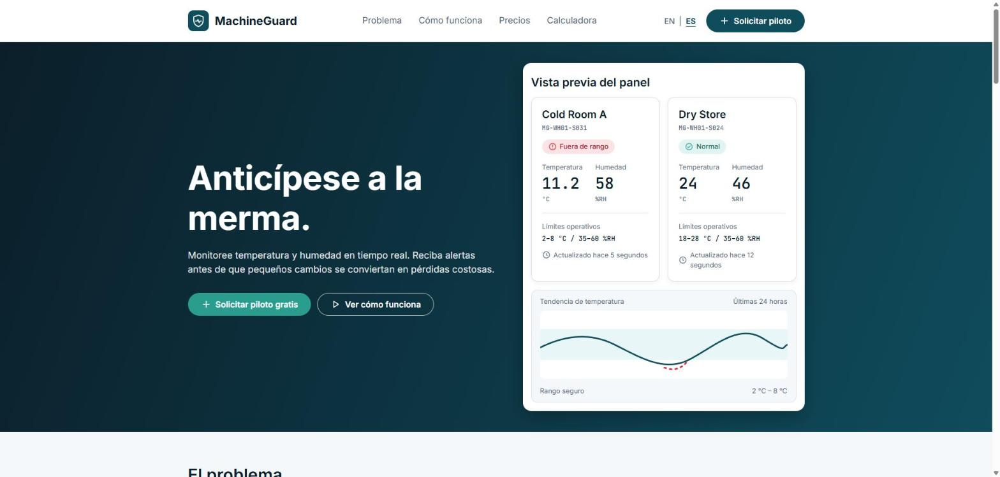
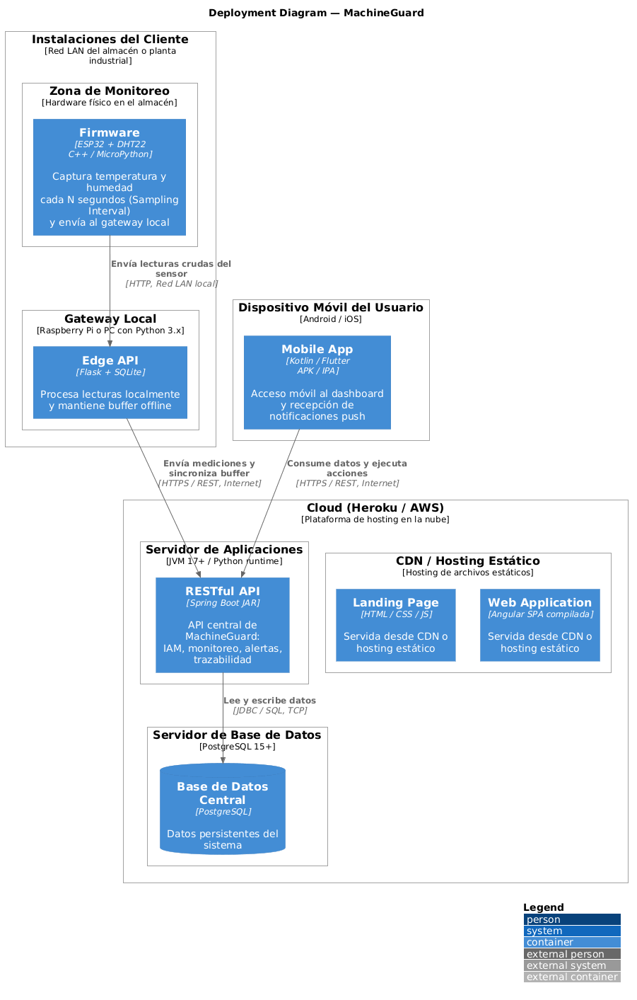

### 6.1.4. Software Deployment Configuration

En esta sección se especifica la configuración de despliegue de los productos digitales de MachineGuard y los pasos necesarios para publicarlos a partir de sus repositorios de código fuente. La estrategia separa los productos según su naturaleza:

- **Productos estáticos** (Landing Page y Web Application): se publican en GitHub Pages mediante workflows de GitHub Actions que construyen el sitio y lo despliegan al integrar cambios en `main`.
- **RESTful API central** (`machineguard-core-api`): se empaqueta como imagen Docker y se ejecuta junto con una base de datos PostgreSQL. Flyway aplica las migraciones al iniciar.
- **Edge API** (`machineguard-edge-api`): se instala en el Edge Gateway (Raspberry Pi o equivalente) dentro de la red del cliente y se conecta con la API central por HTTPS.

Además, cada Web Service cuenta con un workflow de integración continua que ejecuta las pruebas unitarias, de integración y BDD antes de que un cambio se integre a `develop` o `main`.

| Producto | Repositorio | Rama de publicación | Plataforma | URL | Automatización |
|---|---|---|---|---|---|
| Landing Page | [MachineGuard-LandingPage](https://github.com/MachineGuard/MachineGuard-LandingPage) | `main` | GitHub Pages | https://machineguard.github.io/MachineGuard-LandingPage/ | `deploy-pages.yml` |
| Web Application | [machineguard-web](https://github.com/MachineGuard/machineguard-web) | `main` | GitHub Pages | https://machineguard.github.io/machineguard-web/ | `deploy-pages.yml` |
| RESTful API (IAM y Traceability & Quality) | [machineguard-core-api](https://github.com/MachineGuard/machineguard-core-api) | `main` | ⚠️ PENDIENTE (Pedro): plataforma de contenedores | ⚠️ PENDIENTE | `Dockerfile`, `compose.yml`, `ci.yml` |
| Base de datos central | — | — | ⚠️ PENDIENTE (Pedro): PostgreSQL 16 administrado | ⚠️ PENDIENTE | Migraciones Flyway al iniciar la API |
| Edge API | [machineguard-edge-api](https://github.com/MachineGuard/machineguard-edge-api) | `main` | Edge Gateway del cliente | Red local del cliente, puerto 5000 | `ci.yml` |

#### Landing Page

El Landing Page es un sitio estático (HTML5, CSS3 y JavaScript sin dependencias de compilación). El workflow `Deploy Landing Page to GitHub Pages` se ejecuta en cada push a `main` o de forma manual desde la pestaña Actions (`workflow_dispatch`).

Pasos para el despliegue:

1. En el repositorio, ingresar a **Settings > Pages** y seleccionar **GitHub Actions** como fuente de publicación.
2. Integrar los cambios a `main` mediante un pull request desde `develop`, o ejecutar el workflow manualmente.
3. El workflow copia `index.html`, `terms.html`, `privacy.html` y la carpeta `assets` a un directorio `_site`.
4. Las acciones `configure-pages`, `upload-pages-artifact` y `deploy-pages` publican el contenido de `_site` en el entorno `github-pages`.
5. Verificar el sitio en https://machineguard.github.io/MachineGuard-LandingPage/.

#### Web Application

La Web Application es una Single Page Application en Angular 18.2. El workflow `Deploy Angular to GitHub Pages` se ejecuta en cada push a `main` o de forma manual.

Pasos para el despliegue:

1. En el repositorio, ingresar a **Settings > Pages** y seleccionar **GitHub Actions** como fuente de publicación.
2. Integrar los cambios a `main` mediante un pull request desde `develop`, o ejecutar el workflow manualmente.
3. El job `build` instala Node.js 22 con caché de npm, ejecuta `npm ci` y compila con `npm run build -- --base-href=/machineguard-web/`, de modo que las rutas de la aplicación funcionen bajo el subdirectorio del repositorio.
4. El contenido de `dist/machineguard-web/browser` se sube como artefacto de Pages y el job `deploy` lo publica.
5. Verificar la aplicación en https://machineguard.github.io/machineguard-web/.

Configuración de la conexión con la API: la URL base se define en `src/environments/environment.production.ts` (`apiBaseUrl`). En desarrollo local, `proxy.conf.json` redirige `/api` hacia `http://localhost:8080`.

> ⚠️ PENDIENTE (Camilla y Pedro), antes de la entrega:
> 1. Hoy `apiBaseUrl` vale `/api/v1`, por lo que en GitHub Pages las peticiones van a `machineguard.github.io/api/v1`, donde no hay API, y el dashboard publicado muestra "Unable to load monitoring data". Al desplegar la API central, se debe reemplazar por su URL pública (por ejemplo, `https://<api-desplegada>/api/v1`).
> 2. La API central debe permitir CORS para el origen `https://machineguard.github.io`. Hoy `machineguard-core-api` no tiene configuración CORS.
> 3. Al recargar el navegador en una ruta interna (por ejemplo, `/machineguard-web/dashboard`), GitHub Pages responde 404. Se resuelve copiando `index.html` como `404.html` en el workflow, después del build.

#### RESTful API central

La API central (Java 21, Spring Boot 3.5, Spring Security, Spring Data JPA y Flyway) se empaqueta con el `Dockerfile` del repositorio, en dos etapas:

1. **Build:** imagen `maven:3.9.9-eclipse-temurin-21`, que ejecuta `mvn -B -DskipTests package`. Las pruebas se omiten en esta etapa porque ya se ejecutan en el workflow de CI antes de integrar cada cambio.
2. **Runtime:** imagen `eclipse-temurin:21-jre` con el JAR `core-api-0.1.0-SNAPSHOT.jar`, expuesto en el puerto 8080.

Variables de entorno:

| Variable | Descripción | Valor por defecto |
|---|---|---|
| `DB_URL` | URL JDBC de PostgreSQL | `jdbc:postgresql://localhost:5432/machineguard` |
| `DB_USERNAME` | Usuario de la base de datos | `machineguard` |
| `DB_PASSWORD` | Contraseña de la base de datos | (obligatoria) |
| `IAM_JWT_SECRET` | Clave de firma HMAC-SHA256 de los JWT, de al menos 32 bytes | (obligatoria) |
| `IAM_ACCESS_TOKEN_TTL_SECONDS` | Duración del access token, entre 60 y 3600 segundos | `900` |
| `IAM_REFRESH_TOKEN_TTL_DAYS` | Duración del refresh token | `30` |
| `IAM_BOOTSTRAP_ENABLED` y `IAM_BOOTSTRAP_*` | Creación única de la organización y el administrador inicial | `false` |
| `TRACEABILITY_RETENTION_MONTHS` | Meses de retención de excursiones cerradas | `60` |
| `TRACEABILITY_PURGE_ENABLED` | Activa la depuración diaria por retención | `false` |
| `TRACEABILITY_MEASUREMENTS_TABLE` | Tabla de mediciones que consulta Traceability | `measurements` |

Despliegue local con Docker Compose (entorno de desarrollo y pruebas):

1. Instalar Docker Desktop con Docker Compose v2.
2. Copiar `.env.example` a `.env` y reemplazar `MACHINEGUARD_DB_PASSWORD` e `IAM_JWT_SECRET`.
3. Ejecutar `docker compose up --build`. Compose levanta `postgres:16-alpine`, espera a que esté saludable y luego inicia la API, que aplica las migraciones Flyway (V1, V2, V4 y V5).
4. Verificar la documentación en `http://localhost:8080/swagger-ui.html` y `http://localhost:8080/v3/api-docs`.

Despliegue en la nube:

> ⚠️ PENDIENTE (Pedro): completar con la plataforma elegida. Los pasos generales para una plataforma de contenedores son:
> 1. Crear una instancia administrada de PostgreSQL 16 y obtener su URL de conexión.
> 2. Crear un servicio web conectado al repositorio `machineguard-core-api` (rama `main`) que construya la imagen con el `Dockerfile`.
> 3. Registrar las variables de entorno de la tabla anterior. `IAM_JWT_SECRET` y `DB_PASSWORD` se guardan como secretos de la plataforma, nunca en el repositorio.
> 4. Activar el bootstrap una sola vez para crear el administrador inicial y luego desactivarlo.
> 5. Verificar `https://<api-desplegada>/swagger-ui.html` y registrar la URL pública en la Web Application y en la Edge API.

#### Edge API

La Edge API (Flask, Peewee y SQLite) se ejecuta en el Edge Gateway del cliente, que recibe las lecturas de los nodos ESP32 por la red local y las publica en la API central.

Pasos para la instalación en el gateway:

1. Instalar Python 3.12 o superior.
2. Clonar el repositorio `machineguard-edge-api` desde la rama `main`.
3. Crear el entorno virtual con `python -m venv .venv`, activarlo e instalar las dependencias con `pip install -r requirements.txt`.
4. Configurar las variables de entorno:

| Variable | Descripción | Valor por defecto |
|---|---|---|
| `MACHINEGUARD_API_URL` | URL base de la API central; vacía significa sin conectividad | vacía |
| `EDGE_DEVICE_CREDENTIAL` | Credencial del gateway, enviada en la cabecera `X-Device-Credential` | vacía |
| `EDGE_GATEWAY_ID` | Identificador del gateway | `gateway-001` |
| `EDGE_DATABASE_PATH` | Archivo SQLite del Local Buffer | `edge.db` |
| `EDGE_BUFFER_CAPACITY` | Capacidad máxima del Local Buffer | `10000` |
| `EDGE_SYNC_BATCH_SIZE` | Lecturas por lote al sincronizar | `100` |
| `EDGE_SAMPLING_INTERVAL` | Sampling Interval por defecto, en segundos | `60` |
| `EDGE_AVAILABILITY_CHECK_SECONDS` | Frecuencia de revisión de nodos Offline | `30` |

5. Ejecutar `python run.py`. El servicio queda disponible en el puerto 5000 de la red local y se verifica con `GET /api/v1/edge/health`.

> ⚠️ PENDIENTE: la API central todavía no expone `POST /api/v1/measurements` ni `POST /api/v1/measurements/batch`, que son los endpoints a los que la Edge API publica las mediciones. Mientras no existan, la Edge API opera sin conectividad y conserva las lecturas en el Local Buffer.

#### Integración y despliegue continuo

| Repositorio | Workflow | Disparador | Acciones |
|---|---|---|---|
| MachineGuard-LandingPage | `deploy-pages.yml` | Push a `main` o ejecución manual | Prepara `_site` y publica en GitHub Pages. |
| machineguard-web | `deploy-pages.yml` | Push a `main` o ejecución manual | `npm ci`, build de producción con `base-href` y publicación en GitHub Pages. |
| machineguard-core-api | `ci.yml` | Push a `main`, `develop`, `feature/**`, `release/**` y `hotfix/**`; pull requests a `develop` y `main` | `mvn -B verify` en JDK 21 (pruebas unitarias, de integración y BDD) y publicación de reportes. |
| machineguard-edge-api | `ci.yml` | Push a `main`, `develop`, `feature/**`, `release/**` y `hotfix/**`; pull requests a `develop` y `main` | `pytest` en Python 3.12 (pruebas de integración y BDD) y publicación de reportes. |

#### Deployment Diagram

El Deployment Diagram del C4 Model (sección 4.1.3.4) muestra la distribución de los contenedores en tres entornos: las instalaciones del cliente (nodos ESP32 y Edge Gateway con la Edge API), la nube (RESTful API, base de datos PostgreSQL y hosting estático del Landing Page y la Web Application) y el dispositivo móvil del usuario. En el Sprint 1, el hosting estático corresponde a GitHub Pages; la plataforma de la RESTful API y de la base de datos se definirá al desplegar los Web Services.

