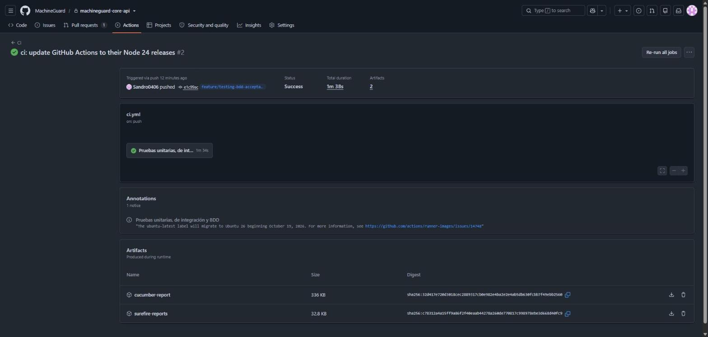
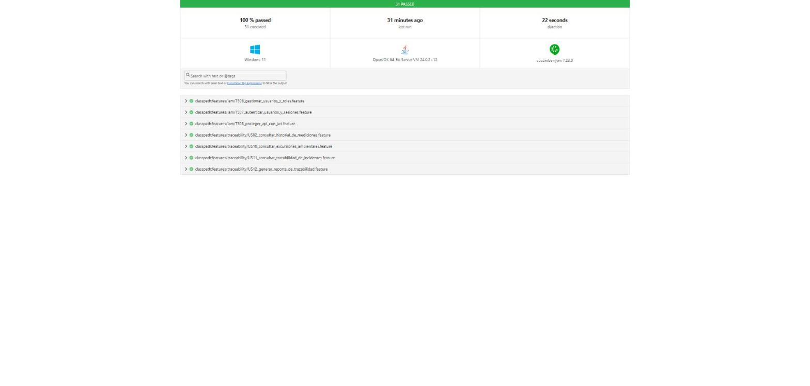
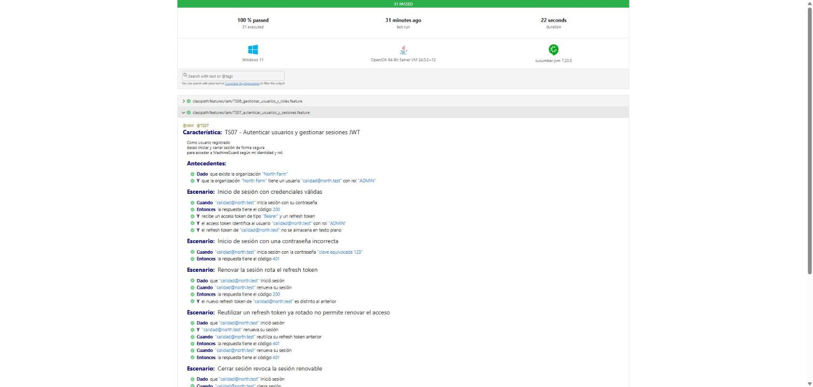

#### 6.2.1.5. Testing Suite Evidence for Sprint Review

Durante el Sprint 1 se construyó la batería de pruebas automatizadas de los dos Web Services del alcance: la RESTful API central (`machineguard-core-api`), con los bounded contexts IAM y Traceability & Quality, y el servicio de borde (`machineguard-edge-api`), con el bounded context Edge Processing. La batería combina tres niveles: Unit Tests sobre el modelo de dominio, Integration Tests que ejercitan los endpoints REST con su persistencia y Acceptance Tests bajo el enfoque BDD.

Los Acceptance Tests traducen a Gherkin los criterios de aceptación de las diez historias del Sprint 1 (Capítulo III). Se elaboró un archivo `.feature` por historia y sus archivos Steps en el lenguaje de cada servicio: Java con Cucumber 7.23 y Spring Boot Test (MockMvc sobre una base H2 propia) en la API central, y Python con pytest-bdd 9.0 (cliente de prueba de Flask) en el servicio de borde. En este Sprint, los eventos de Environmental Monitoring y Alert & Incident Management se publican como eventos Spring dentro de las pruebas, de la misma forma en que lo harán esos bounded contexts al integrarse.

Todas las pruebas se ejecutan automáticamente con GitHub Actions en cada push y en cada pull request hacia `develop` y `main`. Cada ejecución publica los reportes como artefactos: el reporte HTML de Cucumber y los reportes de Surefire en la API central, y los reportes JUnit XML y Cucumber JSON en el servicio de borde.

| Repositorio | Herramientas | Unit Tests | Integration Tests | Acceptance Tests (BDD) | Resultado |
|---|---|---|---|---|---|
| [machineguard-core-api](https://github.com/MachineGuard/machineguard-core-api) | JUnit 5, Spring Boot Test, MockMvc, H2, Cucumber 7.23 | 13 | 21 | 7 features, 31 escenarios | 65 de 65 pruebas aprobadas |
| [machineguard-edge-api](https://github.com/MachineGuard/machineguard-edge-api) | pytest 9.1, pytest-bdd 9.0, cliente de prueba de Flask | — | 12 | 3 features, 15 escenarios | 27 de 27 pruebas aprobadas |

**Unit Tests**

Los Unit Tests de la API central se encuentran en `src/test/java/com/machineguard/platform/traceability/domain/DomainModelTest.java` y verifican las reglas del modelo de dominio de Traceability & Quality sin levantar el contexto de Spring.

| Test | Clase(s) | Comportamiento verificado |
|---|---|---|
| `excursionKeepsMostExtremeValueAsPeak` | `Excursion` | El valor pico conserva la lectura más extrema por encima del umbral. |
| `peakForLowBreachIsTheLowestValue` | `Excursion` | En una desviación por debajo del umbral, el pico es el valor más bajo. |
| `endComputesDurationAndSeverityNeverDecreases` | `Excursion`, `ExcursionSeverity` | Al cerrar, se calcula la duración y la severidad nunca disminuye. |
| `closedExcursionRejectsFurtherChanges` | `Excursion` | Una excursión cerrada no admite nuevas lecturas. |
| `endBeforeStartIsRejected` | `Excursion` | No se puede cerrar una excursión antes de su inicio. |
| `firstLinkedIncidentPrevails` | `Excursion` | Se conserva el primer incidente vinculado. |
| `severityClassificationByMagnitudeAndDuration` | `ExcursionSeverity` | Clasificación LOW, MEDIUM, HIGH y CRITICAL según magnitud y duración. |
| `excursionPeriodOverlapHandlesOpenEnds` | `ExcursionPeriod` | Detección de solapamiento con períodos abiertos y rechazo de períodos invertidos. |
| `nonConformityStartsQuarantinedAndReleaseRequiresJustification` | `NonConformity`, `Batch` | Un lote inicia en cuarentena y liberarlo exige justificación. |
| `batchRequiresCodeAndPositiveQuantity` | `Batch` | El lote exige código y cantidad positiva. |
| `reportCannotIncludeOngoingExcursionsAndIsImmutableOnceSealed` | `TraceabilityReport`, `ReportPeriod` | El reporte excluye excursiones en curso y es inmutable una vez sellado. |
| `reportPeriodValidation` | `ReportPeriod` | Validación de período invertido, futuro o mayor al máximo permitido. |
| `retentionPeriodExpiry` | `RetentionPeriod` | Cálculo del vencimiento del período de retención. |

**Integration Tests**

Los Integration Tests levantan la aplicación con Spring Boot Test, ejecutan las migraciones Flyway sobre H2 en modo PostgreSQL y consumen los endpoints con MockMvc. En el servicio de borde, los Integration Tests usan el cliente de prueba de Flask con una base SQLite temporal, un reloj controlado (`FakeClock`) y una API central simulada (`FakeCloud`).

| Repositorio | Clase o módulo | Tests | Historias relacionadas |
|---|---|---|---|
| machineguard-core-api | `iam/IamApiIntegrationTest.java` | `loginNormalizesEmailAndTraceabilityIgnoresCallerSuppliedIdentityHeaders`, `refreshRotatesTokensAndReplayRevokesThatSession`, `passwordChangeInvalidatesRefreshSessionsAndRequiresCurrentPassword`, `logoutRevokesRefreshSessionAndFailsTokenValidation`, `lastActiveAdministratorCannotBeDemotedOrDeactivated`, `concurrentDemotionsCannotRemoveEveryActiveAdministrator`, `onlyAdminsCanCreateUsersAndNormalizedEmailsAreUniqueAcrossTenants`, `invitationTokenCanOnlyBeConsumedOnce` | TS06, TS07, TS08 |
| machineguard-core-api | `traceability/TraceabilityApiIntegrationTest.java` | `consecutiveDeviationsKeepASingleOpenExcursionWithUpdatedPeak`, `incidentResolvedLinksCorrectiveActionAndClosesExcursionIdempotently`, `incidentResolvedAfterSafeRangeRestoredLinksTheClosedExcursion`, `historyFiltersByZoneAndPeriodAndIsolatesOrganizations`, `nonConformityLifecycleEnforcesBusinessRules`, `nonConformityRequiresExistingExcursionOfTheSameOrganizationAndValidBody`, `generatesSealedReportWithEvidenceAndVerifiableIntegrity`, `tamperedReportFailsIntegrityVerification`, `reportRequestValidation`, `reportReturns503WhenMeasurementHistoryIsUnavailable`, `measurementHistoryByZoneAndByExcursion`, `retentionPurgesExpiredExcursionsExceptThoseInSealedReports`, `openApiDocumentationIsServed` | US02, US10, US11, US12, TS08 |
| machineguard-edge-api | `tests/test_edge_processing.py` | `test_register_node_creates_profile_and_rejects_duplicates`, `test_valid_reading_is_calibrated_and_published_online`, `test_implausible_reading_is_discarded_and_never_published`, `test_reading_keeps_capture_timestamp_of_the_node`, `test_future_timestamp_and_unknown_node_are_rejected`, `test_offline_cloud_buffers_readings_and_sync_is_chronological_and_idempotent`, `test_sync_keeps_pending_when_cloud_is_still_down`, `test_new_readings_are_enqueued_while_buffer_has_pending_to_preserve_order`, `test_full_buffer_drops_oldest_pending_readings`, `test_offset_update_only_affects_later_readings`, `test_node_goes_offline_after_sampling_interval_and_is_restored_on_next_reading`, `test_plausibility_range_endpoint` | TS02, TS03, US03 |

**Acceptance Tests (BDD)**

Cada archivo `.feature` corresponde a una historia del Sprint 1 y cada escenario a uno de sus criterios de aceptación. Las etiquetas (`@IAM`, `@Traceability`, `@EdgeProcessing` y el ID de la historia) permiten ejecutar los escenarios por bounded context o por historia.

| Historia | Archivo `.feature` | Escenarios | Repositorio |
|---|---|---|---|
| TS06 - Gestionar organizaciones, usuarios y roles IAM | `src/test/resources/features/iam/TS06_gestionar_usuarios_y_roles.feature` | 7 | machineguard-core-api |
| TS07 - Autenticar usuarios y gestionar sesiones JWT | `src/test/resources/features/iam/TS07_autenticar_usuarios_y_sesiones.feature` | 6 | machineguard-core-api |
| TS08 - Proteger la API con JWT y documentar IAM | `src/test/resources/features/iam/TS08_proteger_api_con_jwt.feature` | 6 | machineguard-core-api |
| US02 - Consultar historial de mediciones | `src/test/resources/features/traceability/US02_consultar_historial_de_mediciones.feature` | 3 | machineguard-core-api |
| US10 - Consultar excursiones ambientales | `src/test/resources/features/traceability/US10_consultar_excursiones_ambientales.feature` | 3 | machineguard-core-api |
| US11 - Consultar trazabilidad de incidentes | `src/test/resources/features/traceability/US11_consultar_trazabilidad_de_incidentes.feature` | 2 | machineguard-core-api |
| US12 - Generar reporte de trazabilidad | `src/test/resources/features/traceability/US12_generar_reporte_de_trazabilidad.feature` | 4 | machineguard-core-api |
| TS02 - Calibrar y filtrar lecturas en Edge | `tests/features/TS02_calibrar_y_filtrar_lecturas.feature` | 6 (incluye un Scenario Outline con 3 ejemplos) | machineguard-edge-api |
| TS03 - Mantener lecturas ante interrupciones de conectividad | `tests/features/TS03_mantener_lecturas_sin_conectividad.feature` | 6 | machineguard-edge-api |
| US03 - Consultar estado de los puntos de monitoreo | `tests/features/US03_consultar_estado_de_los_puntos_de_monitoreo.feature` | 3 | machineguard-edge-api |

En US11, el Sprint 1 cubre la parte que corresponde a Traceability & Quality: la acción correctiva recibida con `IncidentResolved` queda vinculada a la excursión y los lotes afectados se gestionan como no conformidades. La consulta de Alert y Acknowledgement se agregará cuando se implemente Alert & Incident Management.

*TS06 - Gestionar organizaciones, usuarios y roles IAM*

```gherkin
# language: es
@IAM @TS06
Característica: TS06 - Gestionar organizaciones, usuarios y roles IAM
  Como administrador de una organización
  deseo gestionar usuarios y roles de mi tenant
  para controlar quién puede acceder a MachineGuard.

  Antecedentes:
    Dado que existe la organización "North Farm"
    Y que existe la organización "South Farm"
    Y que la organización "North Farm" tiene un usuario "admin@north.test" con rol "ADMIN"
    Y que la organización "North Farm" tiene un usuario "viewer@north.test" con rol "VIEWER"
    Y que "admin@north.test" inició sesión

  Escenario: Un ADMIN registra un usuario que pertenece solo a su organización
    Cuando "admin@north.test" registra al usuario "  Nuevo.Operario@North.TEST " con rol "VIEWER"
    Entonces la respuesta tiene el código 201
    Y el usuario registrado pertenece a la organización "North Farm"
    Y el usuario registrado tiene el correo "nuevo.operario@north.test"

  Escenario: El correo normalizado es único
    Cuando "admin@north.test" registra al usuario "VIEWER@NORTH.TEST" con rol "VIEWER"
    Entonces la respuesta tiene el código 409

  Escenario: Un ADMIN no puede registrar usuarios en otra organización
    Cuando "admin@north.test" intenta registrar al usuario "intruso@south.test" en la organización "South Farm"
    Entonces la respuesta tiene el código 403

  Escenario: Un VIEWER no puede administrar usuarios
    Dado que "viewer@north.test" inició sesión
    Cuando "viewer@north.test" registra al usuario "otro@north.test" con rol "VIEWER"
    Entonces la respuesta tiene el código 403

  Escenario: Se conserva al menos un administrador activo
    Cuando "admin@north.test" cambia el rol de "admin@north.test" a "VIEWER"
    Entonces la respuesta tiene el código 409
    Cuando "admin@north.test" desactiva al usuario "admin@north.test"
    Entonces la respuesta tiene el código 409
    Y "admin@north.test" sigue siendo un administrador activo

  Escenario: Un usuario inactivo no puede autenticarse
    Dado que la organización "North Farm" tiene un usuario inactivo "baja@north.test" con rol "VIEWER"
    Cuando "baja@north.test" inicia sesión con su contraseña
    Entonces la respuesta tiene el código 401

  Escenario: Un usuario de una organización suspendida no puede autenticarse
    Dado que existe la organización suspendida "Closed Farm"
    Y que la organización "Closed Farm" tiene un usuario "admin@closed.test" con rol "ADMIN"
    Cuando "admin@closed.test" inicia sesión con su contraseña
    Entonces la respuesta tiene el código 401
```

*TS07 - Autenticar usuarios y gestionar sesiones JWT*

```gherkin
# language: es
@IAM @TS07
Característica: TS07 - Autenticar usuarios y gestionar sesiones JWT
  Como usuario registrado
  deseo iniciar y cerrar sesión de forma segura
  para acceder a MachineGuard según mi identidad y rol.

  Antecedentes:
    Dado que existe la organización "North Farm"
    Y que la organización "North Farm" tiene un usuario "calidad@north.test" con rol "ADMIN"

  Escenario: Inicio de sesión con credenciales válidas
    Cuando "calidad@north.test" inicia sesión con su contraseña
    Entonces la respuesta tiene el código 200
    Y recibe un access token de tipo "Bearer" y un refresh token
    Y el access token identifica al usuario "calidad@north.test" con rol "ADMIN"
    Y el refresh token de "calidad@north.test" no se almacena en texto plano

  Escenario: Inicio de sesión con una contraseña incorrecta
    Cuando "calidad@north.test" inicia sesión con la contraseña "clave equivocada 123"
    Entonces la respuesta tiene el código 401

  Escenario: Renovar la sesión rota el refresh token
    Dado que "calidad@north.test" inició sesión
    Cuando "calidad@north.test" renueva su sesión
    Entonces la respuesta tiene el código 200
    Y el nuevo refresh token de "calidad@north.test" es distinto al anterior

  Escenario: Reutilizar un refresh token ya rotado no permite renovar el acceso
    Dado que "calidad@north.test" inició sesión
    Y "calidad@north.test" renueva su sesión
    Cuando "calidad@north.test" reutiliza su refresh token anterior
    Entonces la respuesta tiene el código 401
    Cuando "calidad@north.test" renueva su sesión
    Entonces la respuesta tiene el código 401

  Escenario: Cerrar sesión revoca la sesión renovable
    Dado que "calidad@north.test" inició sesión
    Cuando "calidad@north.test" cierra sesión
    Entonces la respuesta tiene el código 204
    Cuando "calidad@north.test" renueva su sesión
    Entonces la respuesta tiene el código 401

  Escenario: Cambiar la contraseña revoca las sesiones renovables
    Dado que "calidad@north.test" inició sesión
    Cuando "calidad@north.test" cambia su contraseña por "nueva clave segura 2026"
    Entonces la respuesta tiene el código 200
    Cuando "calidad@north.test" renueva su sesión
    Entonces la respuesta tiene el código 401
    Cuando "calidad@north.test" inicia sesión con la contraseña "nueva clave segura 2026"
    Entonces la respuesta tiene el código 200
```

*TS08 - Proteger la API con JWT y documentar IAM*

```gherkin
# language: es
@IAM @TS08
Característica: TS08 - Proteger la API con JWT y documentar IAM
  Como integrador de los servicios MachineGuard
  deseo consumir una API protegida y documentada
  para acceder únicamente a los datos de mi organización.

  Antecedentes:
    Dado que existe la organización "North Farm"
    Y que existe la organización "South Farm"
    Y que la organización "North Farm" tiene un usuario "admin@north.test" con rol "ADMIN"
    Y que la organización "North Farm" tiene un usuario "viewer@north.test" con rol "VIEWER"
    Y que la organización "South Farm" tiene un usuario "admin@south.test" con rol "ADMIN"

  Escenario: Una ruta protegida sin JWT responde 401
    Cuando se consulta "/api/v1/traceability/excursions" sin token
    Entonces la respuesta tiene el código 401

  Escenario: Una ruta protegida con un JWT alterado responde 401
    Cuando se consulta "/api/v1/users/me" con un token alterado
    Entonces la respuesta tiene el código 401

  Escenario: Un VIEWER sin el rol requerido no puede generar reportes
    Dado que la organización "North Farm" tiene la zona de monitoreo "Cold Room A"
    Y que "viewer@north.test" inició sesión
    Cuando "viewer@north.test" genera el reporte de trazabilidad de "Cold Room A" de las últimas 24 horas
    Entonces la respuesta tiene el código 403

  Escenario: Las cabeceras de identidad del cliente no exponen datos de otra organización
    Dado que la organización "North Farm" tiene la zona de monitoreo "Cold Room A"
    Y que en "Cold Room A" se detectó una temperatura de 10.5 grados fuera del rango seguro hace 30 minutos
    Y que "admin@south.test" inició sesión
    Cuando "admin@south.test" consulta las excursiones indicando en las cabeceras la organización "North Farm"
    Entonces la lista devuelta tiene 0 elementos

  Escenario: La identidad se obtiene solo del JWT
    Dado que "admin@north.test" inició sesión
    Cuando "admin@north.test" consulta "/api/v1/users/me"
    Entonces la respuesta tiene el código 200

  Escenario: La documentación OpenAPI expone el esquema Bearer y las operaciones IAM
    Cuando se consulta la documentación OpenAPI
    Entonces la respuesta tiene el código 200
    Y la documentación declara el esquema de seguridad "bearerAuth"
    Y la documentación incluye la operación POST "/api/v1/auth/login"
    Y la documentación incluye la operación POST "/api/v1/auth/refresh"
    Y la documentación incluye la operación GET "/api/v1/users/me"
```

*US02 - Consultar historial de mediciones*

```gherkin
# language: es
@Traceability @US02
Característica: US02 - Consultar historial de mediciones
  Como Jefe de Almacén
  deseo consultar el Measurement History de una Monitoring Zone dentro de un período determinado
  para analizar la evolución de sus condiciones ambientales.

  Antecedentes:
    Dado que existe la organización "North Farm"
    Y que la organización "North Farm" tiene un usuario "almacen@north.test" con rol "VIEWER"
    Y que "almacen@north.test" inició sesión
    Y que la organización "North Farm" tiene la zona de monitoreo "Cold Room A"

  Escenario: Se obtienen las mediciones del período solicitado
    Dado que en "Cold Room A" se registró una medición de temperatura de 4.5 grados hace 50 minutos
    Y que en "Cold Room A" se registró una medición de temperatura de 5.1 grados hace 30 minutos
    Y que en "Cold Room A" se registró una medición de temperatura de 6.0 grados hace 10 minutos
    Y que en "Cold Room A" se registró una medición de temperatura de 3.9 grados hace 300 minutos
    Cuando "almacen@north.test" consulta el historial de mediciones de "Cold Room A" de los últimos 60 minutos
    Entonces el historial contiene 3 mediciones

  Escenario: No existen mediciones en el período solicitado
    Dado que en "Cold Room A" se registró una medición de temperatura de 3.9 grados hace 300 minutos
    Cuando "almacen@north.test" consulta el historial de mediciones de "Cold Room A" de los últimos 60 minutos
    Entonces el historial contiene 0 mediciones

  Escenario: Un período inválido es rechazado
    Cuando "almacen@north.test" consulta el historial de mediciones de "Cold Room A" con un período invertido
    Entonces la respuesta tiene el código 400
```

*US10 - Consultar excursiones ambientales*

```gherkin
# language: es
@Traceability @US10
Característica: US10 - Consultar excursiones ambientales
  Como Encargado de Control de Calidad
  deseo consultar las Excursions ocurridas durante un período determinado
  para identificar situaciones en las que los productos estuvieron expuestos a condiciones fuera del rango establecido.

  Antecedentes:
    Dado que existe la organización "North Farm"
    Y que la organización "North Farm" tiene un usuario "calidad@north.test" con rol "ADMIN"
    Y que "calidad@north.test" inició sesión
    Y que la organización "North Farm" tiene la zona de monitoreo "Cold Room A"

  Escenario: Se registra una excursión entre la salida y el retorno al rango seguro
    Dado que en "Cold Room A" se detectó una temperatura de 9.5 grados fuera del rango seguro hace 90 minutos
    Y que la temperatura de "Cold Room A" volvió al rango seguro hace 30 minutos
    Cuando "calidad@north.test" consulta las excursiones de "Cold Room A"
    Entonces la lista devuelta tiene 1 elementos
    Y la primera excursión tiene el estado "CLOSED"
    Y la primera excursión duró 60 minutos

  Escenario: Desviaciones consecutivas mantienen una sola excursión abierta con el valor pico
    Dado que en "Cold Room A" se detectó una temperatura de 8.5 grados fuera del rango seguro hace 20 minutos
    Y que en "Cold Room A" se detectó una temperatura de 11.0 grados fuera del rango seguro hace 15 minutos
    Y que en "Cold Room A" se detectó una temperatura de 9.0 grados fuera del rango seguro hace 5 minutos
    Cuando "calidad@north.test" consulta las excursiones abiertas
    Entonces la lista devuelta tiene 1 elementos
    Y la primera excursión tiene el estado "ONGOING"
    Y la primera excursión tiene un valor pico de 11.0 grados

  Escenario: Se consultan solo las excursiones del período solicitado
    Dado que en "Cold Room A" se detectó una temperatura de 10.0 grados fuera del rango seguro hace 4320 minutos
    Y que la temperatura de "Cold Room A" volvió al rango seguro hace 4300 minutos
    Y que en "Cold Room A" se detectó una temperatura de 9.0 grados fuera del rango seguro hace 120 minutos
    Y que la temperatura de "Cold Room A" volvió al rango seguro hace 100 minutos
    Cuando "calidad@north.test" consulta las excursiones de "Cold Room A" desde hace 24 horas
    Entonces la lista devuelta tiene 1 elementos
    Y la primera excursión tiene un valor pico de 9.0 grados
```

*US11 - Consultar trazabilidad de incidentes*

```gherkin
# language: es
@Traceability @US11
Característica: US11 - Consultar trazabilidad de incidentes
  Como Encargado de Control de Calidad
  deseo consultar el historial de Incidents
  para disponer de evidencia de las desviaciones y acciones tomadas durante un período de almacenamiento.

  # Alcance del Sprint 1: Traceability recibe IncidentResolved y vincula la acción correctiva a la excursión.
  # La consulta de Alert y Acknowledgement se cubrirá cuando se implemente Alert & Incident Management.

  Antecedentes:
    Dado que existe la organización "North Farm"
    Y que la organización "North Farm" tiene un usuario "calidad@north.test" con rol "ADMIN"
    Y que "calidad@north.test" inició sesión
    Y que la organización "North Farm" tiene la zona de monitoreo "Cold Room A"
    Y que en "Cold Room A" se detectó una temperatura de 9.5 grados fuera del rango seguro hace 60 minutos

  Escenario: La excursión muestra el incidente y su acción correctiva
    Dado que el incidente de "Cold Room A" se resolvió hace 20 minutos con la acción correctiva "Se reemplazó el compresor"
    Cuando "calidad@north.test" consulta el detalle de la última excursión de "Cold Room A"
    Entonces la respuesta tiene el código 200
    Y el detalle muestra la acción correctiva "Se reemplazó el compresor"

  Escenario: Un lote afectado se registra en cuarentena y liberarlo exige justificación
    Dado que la temperatura de "Cold Room A" volvió al rango seguro hace 10 minutos
    Cuando "calidad@north.test" registra el lote "L-2026-001" de "Insulina" como no conformidad de la última excursión de "Cold Room A"
    Entonces la respuesta tiene el código 201
    Y el lote queda con la disposición "QUARANTINED"
    Cuando "calidad@north.test" libera el lote sin justificación
    Entonces la respuesta tiene el código 409
    Cuando "calidad@north.test" libera el lote con la justificación "Laboratorio confirmó la estabilidad del producto"
    Entonces la respuesta tiene el código 200
    Y el lote queda con la disposición "RELEASED"
    Cuando "calidad@north.test" consulta el detalle de la última excursión de "Cold Room A"
    Entonces el detalle muestra 1 no conformidades
```

*US12 - Generar reporte de trazabilidad*

```gherkin
# language: es
@Traceability @US12
Característica: US12 - Generar reporte de trazabilidad
  Como Encargado de Control de Calidad
  deseo generar un Traceability Report
  para sustentar las condiciones ambientales registradas durante una auditoría interna o externa.

  Antecedentes:
    Dado que existe la organización "North Farm"
    Y que la organización "North Farm" tiene un usuario "calidad@north.test" con rol "ADMIN"
    Y que "calidad@north.test" inició sesión
    Y que la organización "North Farm" tiene la zona de monitoreo "Cold Room A"
    Y que en "Cold Room A" se registró una medición de temperatura de 9.8 grados hace 170 minutos
    Y que en "Cold Room A" se registró una medición de temperatura de 6.2 grados hace 100 minutos

  Escenario: El reporte resume mediciones, excursiones y acciones correctivas del período
    Dado que en "Cold Room A" se detectó una temperatura de 9.8 grados fuera del rango seguro hace 180 minutos
    Y que el incidente de "Cold Room A" se resolvió hace 120 minutos con la acción correctiva "Se ajustó el termostato"
    Cuando "calidad@north.test" genera el reporte de trazabilidad de "Cold Room A" de las últimas 24 horas
    Entonces la respuesta tiene el código 201
    Y el reporte queda en estado "SEALED"
    Y el reporte incluye 1 excursiones cerradas y 2 mediciones
    Y el reporte registra 1 acciones correctivas
    Y el reporte está sellado con un checksum SHA-256 verificable

  Escenario: Un período sin incidentes conserva las mediciones disponibles
    Cuando "calidad@north.test" genera el reporte de trazabilidad de "Cold Room A" de las últimas 24 horas
    Entonces la respuesta tiene el código 201
    Y el reporte incluye 0 excursiones cerradas y 2 mediciones
    Y el reporte registra 0 acciones correctivas

  Escenario: Las excursiones en curso no se incluyen como evidencia cerrada
    Dado que en "Cold Room A" se detectó una temperatura de 10.2 grados fuera del rango seguro hace 15 minutos
    Cuando "calidad@north.test" genera el reporte de trazabilidad de "Cold Room A" de las últimas 24 horas
    Entonces la respuesta tiene el código 201
    Y el reporte incluye 0 excursiones cerradas y 2 mediciones
    Y el reporte indica que excluyó 1 excursiones en curso

  Escenario: Un reporte alterado no supera la verificación de integridad
    Dado "calidad@north.test" genera el reporte de trazabilidad de "Cold Room A" de las últimas 24 horas
    Y que alguien modificó el reporte directamente en la base de datos
    Cuando "calidad@north.test" consulta el reporte generado
    Entonces el sistema detecta que la integridad del reporte no es válida
```

*TS02 - Calibrar y filtrar lecturas en Edge*

```gherkin
# language: es
@EdgeProcessing @TS02
Característica: TS02 - Calibrar y filtrar lecturas en Edge
  Como Developer
  deseo que el Edge Service calibre y filtre las Readings obtenidas por los Sensor Nodes
  para enviar al servicio central Measurements consistentes y confiables.

  Antecedentes:
    Dado que el gateway Edge tiene registrado el nodo "esp32-01" con un intervalo de muestreo de 60 segundos
    Y que la API central está disponible

  Escenario: Se aplica el Calibration Offset a una lectura válida
    Dado que el nodo "esp32-01" tiene un offset de calibración de -0.5 °C y 2 % de humedad
    Cuando el nodo "esp32-01" envía una lectura de 5.0 °C y 60 % de humedad
    Entonces la respuesta tiene el código 201
    Y la medición calibrada es de 4.5 °C y 62 % de humedad
    Y se publicaron 1 mediciones en la API central

  Esquema del escenario: Una lectura fuera del rango físico del sensor se descarta
    Cuando el nodo "esp32-01" envía una lectura de <temperatura> °C y <humedad> % de humedad
    Entonces la respuesta tiene el código 202
    Y la lectura queda con el estado "DISCARDED"
    Y se publicaron 0 mediciones en la API central
    Y hay 1 lecturas descartadas

    Ejemplos:
      | temperatura | humedad |
      | 300         | 60      |
      | -55         | 60      |
      | 5           | 120     |

  Escenario: Cambiar el offset solo afecta a las lecturas posteriores
    Cuando el nodo "esp32-01" envía una lectura de 5.0 °C y 60 % de humedad
    Y se cambia el offset de calibración del nodo "esp32-01" a 1.0 °C y 0 % de humedad
    Y el nodo "esp32-01" envía una lectura de 5.0 °C y 60 % de humedad
    Entonces la medición calibrada es de 6.0 °C y 60 % de humedad
    Y la primera lectura conserva una temperatura calibrada de 5.0 °C

  Escenario: Una lectura de un nodo no registrado es rechazada
    Cuando el nodo "esp32-99" envía una lectura de 5.0 °C y 60 % de humedad
    Entonces la respuesta tiene el código 404
```

*TS03 - Mantener lecturas ante interrupciones de conectividad*

```gherkin
# language: es
@EdgeProcessing @TS03
Característica: TS03 - Mantener lecturas ante interrupciones de conectividad
  Como Developer
  deseo que el Edge Service conserve temporalmente las Measurements cuando no exista comunicación con el servicio central
  para evitar vacíos en el Measurement History.

  Antecedentes:
    Dado que el gateway Edge tiene registrado el nodo "esp32-01" con un intervalo de muestreo de 60 segundos

  Escenario: Sin conexión las mediciones se conservan en el Local Buffer
    Dado que la API central no está disponible
    Cuando el nodo "esp32-01" envía una lectura capturada hace 30 minutos
    Y el nodo "esp32-01" envía una lectura capturada hace 20 minutos
    Y el nodo "esp32-01" envía una lectura capturada hace 10 minutos
    Entonces el Local Buffer tiene 3 mediciones pendientes
    Y se publicaron 0 mediciones en la API central

  Escenario: Al recuperar la conexión se transmiten las mediciones con su marca temporal original
    Dado que la API central no está disponible
    Y que el nodo "esp32-01" envió una lectura capturada hace 10 minutos
    Y que el nodo "esp32-01" envió una lectura capturada hace 30 minutos
    Y que el nodo "esp32-01" envió una lectura capturada hace 20 minutos
    Cuando se restablece la conexión con la API central
    Y el gateway sincroniza el Local Buffer
    Entonces se sincronizan 3 mediciones
    Y el lote enviado conserva las marcas temporales de hace 30, 20 y 10 minutos en orden cronológico
    Y el Local Buffer tiene 0 mediciones pendientes

  Escenario: Una medición ya sincronizada no se vuelve a enviar
    Dado que la API central no está disponible
    Y que el nodo "esp32-01" envió una lectura capturada hace 5 minutos
    Y que se restablece la conexión con la API central
    Y que el gateway sincronizó el Local Buffer
    Cuando el gateway sincroniza el Local Buffer
    Entonces se sincronizan 0 mediciones
    Y la API central recibió 1 lotes

  Escenario: Si la API central sigue caída la sincronización conserva las pendientes
    Dado que la API central no está disponible
    Y que el nodo "esp32-01" envió una lectura capturada hace 5 minutos
    Cuando el gateway sincroniza el Local Buffer
    Entonces se sincronizan 0 mediciones
    Y el Local Buffer tiene 1 mediciones pendientes

  Escenario: Mientras haya pendientes las nuevas lecturas también se encolan
    Dado que la API central no está disponible
    Y que el nodo "esp32-01" envió una lectura capturada hace 5 minutos
    Cuando se restablece la conexión con la API central
    Y el nodo "esp32-01" envía una lectura capturada hace 1 minutos
    Entonces se publicaron 0 mediciones en la API central
    Y el Local Buffer tiene 2 mediciones pendientes

  Escenario: Con el Local Buffer lleno se descartan las pendientes más antiguas
    Dado que el Local Buffer del gateway tiene capacidad para 2 mediciones
    Y que la API central no está disponible
    Y que el nodo "esp32-01" envió una lectura capturada hace 10 minutos
    Y que el nodo "esp32-01" envió una lectura capturada hace 9 minutos
    Y que el nodo "esp32-01" envió una lectura capturada hace 8 minutos
    Entonces el Local Buffer tiene 2 mediciones pendientes
    Y el Local Buffer tiene el estado "FULL"
    Y la medición pendiente más antigua fue capturada hace 9 minutos
```

*US03 - Consultar estado de los puntos de monitoreo*

```gherkin
# language: es
@EdgeProcessing @US03
Característica: US03 - Consultar estado de los puntos de monitoreo
  Como Jefe de Almacén
  deseo conocer el estado de conectividad de cada Sensor Node
  para identificar puntos de monitoreo que hayan dejado de reportar información.

  Antecedentes:
    Dado que el gateway Edge tiene registrado el nodo "esp32-01" con un intervalo de muestreo de 60 segundos
    Y que la API central está disponible
    Y que el nodo "esp32-01" envió una lectura capturada hace 0 minutos

  Escenario: Un nodo que reporta dentro del Sampling Interval se considera activo
    Cuando pasan 30 segundos
    Entonces el nodo "esp32-01" tiene el estado "ONLINE"
    Y no hay nodos Offline

  Escenario: Un nodo que deja de reportar se identifica como Offline Node
    Cuando pasan 90 segundos
    Entonces el nodo "esp32-01" aparece entre los nodos Offline
    Y el nodo "esp32-01" tiene el estado "OFFLINE"

  Escenario: Un nodo Offline se restaura al recibir una nueva lectura
    Dado que pasan 90 segundos
    Y que el nodo "esp32-01" aparece entre los nodos Offline
    Cuando el nodo "esp32-01" envía una lectura capturada hace 0 minutos
    Entonces no hay nodos Offline
    Y el nodo "esp32-01" tiene el estado "ONLINE"
```

**Archivos Steps**

| Repositorio | Archivo | Lenguaje | Responsabilidad |
|---|---|---|---|
| machineguard-core-api | `src/test/java/com/machineguard/platform/acceptance/CucumberAcceptanceTest.java` | Java | Suite JUnit Platform que ejecuta los `.feature` y genera los reportes HTML y JUnit. |
| machineguard-core-api | `src/test/java/com/machineguard/platform/acceptance/CucumberSpringConfiguration.java` | Java | Contexto de Spring Boot de la suite, con base H2 propia y MockMvc. |
| machineguard-core-api | `src/test/java/com/machineguard/platform/acceptance/ScenarioContext.java` | Java | Estado compartido entre pasos durante un escenario (tokens, organizaciones, zonas y última respuesta). |
| machineguard-core-api | `src/test/java/com/machineguard/platform/acceptance/CommonSteps.java` | Java | Limpieza de datos antes de cada escenario y validaciones comunes de la respuesta HTTP. |
| machineguard-core-api | `src/test/java/com/machineguard/platform/acceptance/IamSteps.java` | Java | Pasos de TS06, TS07 y TS08. |
| machineguard-core-api | `src/test/java/com/machineguard/platform/acceptance/TraceabilitySteps.java` | Java | Pasos de US02, US10, US11 y US12. |
| machineguard-edge-api | `tests/test_bdd_acceptance.py` | Python | Pasos de TS02, TS03 y US03 sobre los fixtures `FakeCloud` y `FakeClock`. |

**Ejecución**

Las pruebas se ejecutan localmente con los siguientes comandos:

| Repositorio | Toda la batería | Solo BDD | Reporte |
|---|---|---|---|
| machineguard-core-api | `mvn test` | `mvn test -Dtest=CucumberAcceptanceTest` | `target/cucumber-reports/cucumber.html` |
| machineguard-edge-api | `python -m pytest` | `python -m pytest tests/test_bdd_acceptance.py -v` | `python -m pytest --cucumberjson=reports/cucumber.json` |

La ejecución en GitHub Actions de la API central concluyó con 65 pruebas aprobadas, de las cuales 31 son escenarios BDD con 276 pasos:




El reporte HTML de Cucumber muestra el resultado por historia y el detalle de cada paso:





En el servicio de borde, la ejecución en GitHub Actions concluyó con 27 pruebas aprobadas, de las cuales 15 son escenarios BDD:


**Repositorios y commits de Testing**

Las pruebas se encuentran en los repositorios [MachineGuard/machineguard-core-api](https://github.com/MachineGuard/machineguard-core-api) y [MachineGuard/machineguard-edge-api](https://github.com/MachineGuard/machineguard-edge-api). Los Acceptance Tests y la integración continua se desarrollaron en la rama `feature/testing-bdd-acceptance` de ambos repositorios.

| Repository | Branch | Commit Id | Commit Message | Commit Message Body | Committed on (Date) |
|---|---|---|---|---|---|
| MachineGuard/machineguard-core-api | develop | 2695724 | test(traceability): cover domain rules and REST API end to end | — | 02/10/2026 |
| MachineGuard/machineguard-edge-api | develop | 7b9c6df | test(edge-processing): cover calibration, local buffer sync and offline node detection | — | 02/10/2026 |
| MachineGuard/machineguard-core-api | feature/testing-bdd-acceptance | 9590b45 | build(test): add Cucumber dependencies for BDD acceptance tests | Import the Cucumber BOM (7.23.0, the last line built against JUnit 5.12, which Spring Boot 3.5 manages) and add cucumber-java, cucumber-spring, the Cucumber JUnit Platform engine and junit-platform-suite as test dependencies. | 07/10/2026 |
| MachineGuard/machineguard-core-api | feature/testing-bdd-acceptance | 5f00ec9 | test(acceptance): add BDD scenarios for IAM stories TS06, TS07 and TS08 | Gherkin scenarios (Spanish) mirror the acceptance criteria in Chapter III: tenant-scoped user management, last active admin protection, login, refresh token rotation and replay, logout, password change, 401/403 handling, identity headers ignored and OpenAPI bearer scheme. The suite runs on its own H2 database so it does not share data with the existing integration tests, and writes an HTML report to target/cucumber-reports. | 07/10/2026 |
| MachineGuard/machineguard-core-api | feature/testing-bdd-acceptance | c9856f5 | test(acceptance): add BDD scenarios for Traceability stories US02, US10, US11 and US12 | Cover measurement history by period, excursion lifecycle and period filtering, corrective actions linked through IncidentResolved, non-conformity disposition rules, and sealed traceability reports with integrity verification. Events from Environmental Monitoring and Alert & Incident Management are published as Spring events, as those contexts will do once integrated. | 07/10/2026 |
| MachineGuard/machineguard-edge-api | feature/testing-bdd-acceptance | cb8b21e | build(test): add pytest-bdd and register BDD markers | Add pytest-bdd 9.0.0, point it at tests/ as the features base directory, register the story tags as pytest markers and ignore the generated reports folder. | 07/10/2026 |
| MachineGuard/machineguard-edge-api | feature/testing-bdd-acceptance | 45a5157 | test(edge-processing): add BDD scenarios for TS02, TS03 and US03 | Gherkin scenarios (Spanish) mirror the acceptance criteria in Chapter III: calibration offset applied to valid readings, implausible readings discarded (scenario outline), offset changes affecting only later readings, Local Buffer while the central API is down, chronological and idempotent sync keeping the original capture timestamp, full buffer dropping the oldest readings, and Sensor Node online/offline detection. Steps reuse the FakeCloud and FakeClock fixtures from conftest.py. | 07/10/2026 |

Las pruebas de integración de IAM se incorporaron junto con la implementación del bounded context en el commit `40a7ad9` (`feat(iam): add tenant authentication and local deployment`, 04/10/2026).
